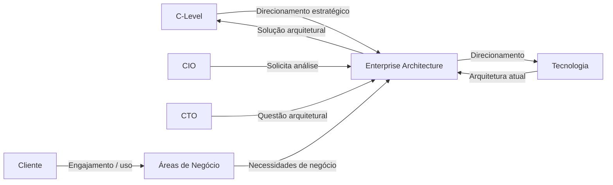
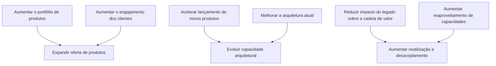
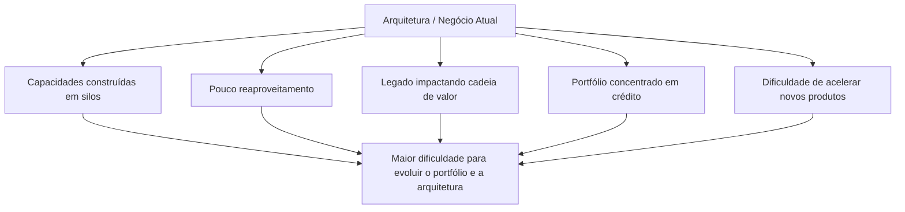
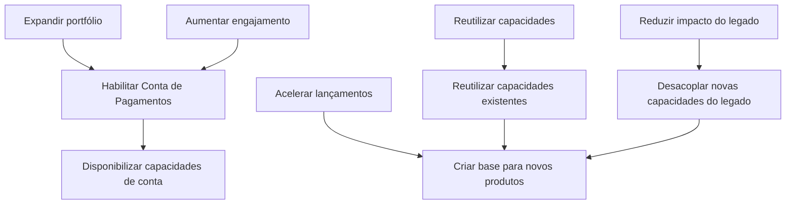
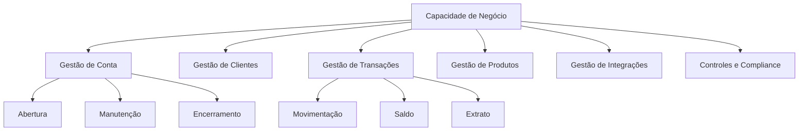
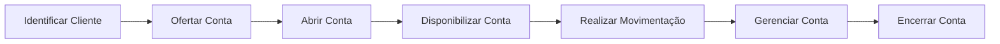
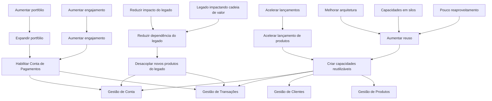
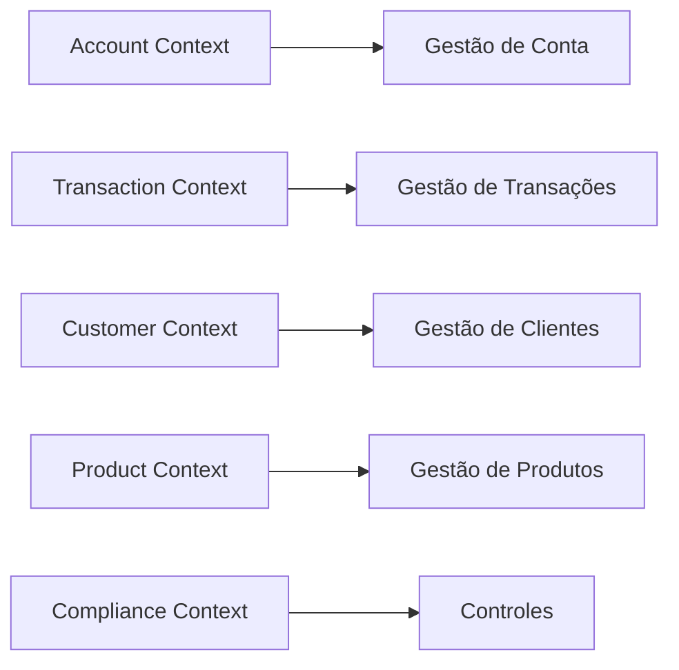

# Scenario 1 — Conta de Pagamentos
# Strategy & Motivation Layer

## 1. Objetivo

Este documento representa a camada de **Strategy & Motivation** para o cenário de **Conta de Pagamentos**, utilizando os conceitos de arquitetura estratégica associados ao TOGAF e a uma modelagem de motivação/estratégia.

O objetivo é estabelecer a rastreabilidade entre:

```text
Drivers
   ↓
Assessment
   ↓
Problems / Issues
   ↓
Goals
   ↓
Objectives
   ↓
Outcomes
   ↓
Capabilities
   ↓
Value Streams
```

A camada não define ainda a arquitetura tecnológica TO-BE nem uma decisão sobre aquisição de Core Bancário.

---

# 2. Evidências do Case

O case apresenta os seguintes fatos relevantes:

- O banco deseja aumentar o portfólio de produtos e o engajamento.
- Conta de Pagamentos e Cashback com parcerias foram os produtos que apresentaram melhores resultados nos testes realizados.
- O C-level entende que os dois produtos endereçam o problema de engajamento, mas apenas um será priorizado.
- Existe a expectativa de que o novo produto também contribua para melhorar a arquitetura atual e acelerar o lançamento de novos produtos.
- O CTO questiona se a aquisição de uma plataforma de Core Bancário poderia resolver esses problemas.
- O portfólio atual é predominantemente baseado em produtos de crédito.
- As capacidades atuais foram construídas em silos, com pouco reaproveitamento.
- O legado impacta a cadeia de valor.
- A arquitetura atual utiliza Microservices e esse estilo deve ser preservado.
- A análise deve considerar boas práticas do setor bancário.
- Elementos não aderentes devem ser tratados em uma arquitetura TO-BE e em um plano de migração.

Fonte: case de avaliação de Enterprise Architecture.

---

# 3. Stakeholders



## 3.1 C-Level

Interesse:

- aumento do portfólio;
- aumento do engajamento;
- priorização de um novo produto;
- melhoria da arquitetura;
- aceleração de novos lançamentos.

## 3.2 CIO

Interesse:

- garantir que a decisão sobre transformação arquitetural seja precedida por análise de Enterprise Architecture.

## 3.3 CTO

Interesse:

- avaliar se a aquisição de uma plataforma de Core Bancário pode endereçar os problemas existentes.

## 3.4 Enterprise Architecture

Responsabilidade no contexto do case:

- analisar problemas de negócio;
- avaliar capacidades;
- avaliar arquitetura atual;
- propor arquitetura alvo;
- avaliar alternativas;
- estabelecer estratégia de evolução.

## 3.5 Cliente

Interesse relacionado ao cenário:

- acesso ao novo produto;
- utilização da Conta de Pagamentos;
- melhoria da experiência e do relacionamento com o banco.

---

# 4. Drivers Estratégicos

Os drivers representam forças que motivam a transformação.



## Drivers principais

| ID | Driver | Natureza |
|---|---|---|
| D-001 | Aumentar o portfólio de produtos | Negócio |
| D-002 | Aumentar o engajamento dos clientes | Negócio |
| D-003 | Acelerar o lançamento de novos produtos | Estratégico |
| D-004 | Melhorar a arquitetura atual | Arquitetural |
| D-005 | Reduzir o impacto do legado na cadeia de valor | Arquitetural |
| D-006 | Aumentar o reaproveitamento das capacidades | Arquitetural |

---

# 5. Assessment — Situação Atual

A análise do case permite identificar os seguintes problemas:



## Problemas identificados

| ID | Problema | Evidência |
|---|---|---|
| P-001 | Capacidades construídas em silos | Case |
| P-002 | Baixo reaproveitamento de capacidades | Case |
| P-003 | Legado impactando a cadeia de valor | Case |
| P-004 | Portfólio predominantemente baseado em crédito | Case |
| P-005 | Necessidade de acelerar lançamentos | Case |
| P-006 | Necessidade de avaliar transformação arquitetural | Case |

---

# 6. Goal — Objetivos Estratégicos

A partir dos drivers e problemas apresentados, são derivados os seguintes objetivos estratégicos.

## G-001 — Expandir o portfólio de produtos

Disponibilizar novos produtos capazes de ampliar as opções oferecidas aos clientes.

## G-002 — Aumentar o engajamento dos clientes

Utilizar o novo produto como mecanismo para ampliar o relacionamento do cliente com o banco.

## G-003 — Aumentar a velocidade de lançamento de produtos

Criar condições arquiteturais para reduzir o esforço e as dependências necessárias para novos lançamentos.

## G-004 — Aumentar o reaproveitamento de capacidades

Reduzir a duplicação de capacidades entre produtos e favorecer sua reutilização.

## G-005 — Reduzir o impacto do legado

Diminuir a dependência direta dos novos produtos em relação aos silos existentes.

---

# 7. Objectives — Cenário Conta de Pagamentos

Para o cenário específico de Conta de Pagamentos, os objetivos estratégicos podem ser refinados em:



---

# 8. Outcomes

Os outcomes representam resultados esperados da transformação.

Importante: os outcomes abaixo são objetivos de transformação, não resultados já comprovados.

| ID | Outcome | Relação |
|---|---|---|
| OC-001 | Conta de Pagamentos disponível como novo produto | O-001 |
| OC-002 | Capacidades de conta reutilizáveis por outros produtos | O-003 |
| OC-003 | Menor dependência direta do legado para novos produtos | O-004 |
| OC-004 | Maior velocidade para composição de novos produtos | O-005 |
| OC-005 | Maior integração entre capacidades de negócio | O-003/O-004 |

---

# 9. Capabilities Estratégicas

A camada estratégica não deve começar pelos Microservices. Primeiro devem ser identificadas as capacidades necessárias.

Para o cenário de Conta de Pagamentos:



## Capacidades relevantes

| Capacidade | Papel no cenário |
|---|---|
| Gestão de Conta | Capacidade central para o novo produto |
| Gestão de Clientes | Identificação e relacionamento com o cliente |
| Gestão de Transações | Suporte às movimentações da conta |
| Gestão de Produtos | Definição das características do produto |
| Gestão de Integrações | Interoperabilidade com sistemas e capacidades |
| Controles e Compliance | Suporte aos controles aplicáveis ao produto |

---

# 10. Value Stream

O fluxo de valor estratégico candidato para o cenário é:



Uma visão simplificada:

```text
Atrair / Identificar
       ↓
Ofertar
       ↓
Abrir
       ↓
Disponibilizar
       ↓
Utilizar
       ↓
Gerenciar
       ↓
Encerrar
```

Esse fluxo deverá ser refinado posteriormente com as áreas de negócio.

---

# 11. Relationship — Estratégia e Motivação

A visão consolidada pode ser representada assim:



---

# 12. Rastreabilidade

A rastreabilidade inicial do cenário fica:

```text
Driver
  │
  ├── Aumentar portfólio
  │        ↓
  │   Expandir oferta
  │        ↓
  │   Habilitar Conta de Pagamentos
  │
  ├── Aumentar engajamento
  │        ↓
  │   Novo produto
  │        ↓
  │   Conta de Pagamentos
  │
  ├── Acelerar lançamentos
  │        ↓
  │   Reutilização
  │        ↓
  │   Capacidades compartilháveis
  │
  └── Reduzir impacto do legado
           ↓
      Desacoplamento
           ↓
      Arquitetura TO-BE
```

---

# 13. Relação com os requisitos

Os requisitos já levantados podem ser associados à camada estratégica.

| Requisito | Elemento estratégico relacionado |
|---|---|
| Permitir Conta de Pagamentos | Habilitar Conta de Pagamentos |
| Permitir movimentação financeira | Gestão de Transações |
| Integrar com capacidades existentes | Reutilização de capacidades |
| Permitir interoperabilidade | Evolução arquitetural |
| Manter Microservices | Restrição arquitetural |
| Acelerar lançamento de produtos | Objetivo estratégico |
| Reduzir dependência do legado | Objetivo arquitetural |
| Permitir migração gradual | Arquitetura TO-BE |

---

# 14. Relação com Bounded Contexts

Para este cenário, os Bounded Contexts identificados anteriormente podem ser relacionados às capacidades:



A definição de quais Bounded Contexts serão efetivamente considerados Core, Supporting ou Generic deve ser realizada em uma etapa posterior.

---

# 15. Hipóteses arquiteturais

As seguintes hipóteses emergem da análise:

### H-001

A Conta de Pagamentos deve possuir uma fronteira de negócio própria, evitando sua implementação como extensão direta de um produto de crédito.

### H-002

Capacidades de Cliente, Produto e Transação podem possuir potencial de reutilização.

### H-003

O legado deverá ser isolado sempre que seus modelos ou interfaces criarem acoplamento inadequado com a nova solução.

### H-004

A aquisição de Core Bancário deve ser avaliada em função das capacidades necessárias, e não como premissa arquitetural.

### H-005

A evolução deverá ser incremental, podendo utilizar arquiteturas intermediárias.

Estas são hipóteses de trabalho e deverão ser validadas nas próximas fases.

---

# 16. Questões em aberto

1. Quais capacidades de Conta de Pagamentos já existem no banco?
2. Quais capacidades estão atualmente nos sistemas legados?
3. Quais capacidades podem ser reutilizadas?
4. Qual é o limite entre Account e Transaction?
5. Quais operações financeiras fazem parte do produto?
6. Quais requisitos regulatórios são aplicáveis?
7. Quais capacidades poderiam ser fornecidas por um Core Bancário?
8. Quais capacidades devem permanecer sob controle do banco?
9. Quais capacidades são estratégicas para diferenciação?
10. Quais métricas representarão o sucesso da transformação?
11. Qual será a arquitetura intermediária?
12. Quais sistemas legados precisam ser desacoplados primeiro?

---

# 17. Próxima etapa

A camada Strategy & Motivation não deve saltar diretamente para Microservices.

O próximo encadeamento recomendado é:

```text
Strategy & Motivation
        ↓
Business Architecture
        ↓
Capabilities
        ↓
Value Streams
        ↓
Business Functions
        ↓
Application Architecture
        ↓
Building Blocks
        ↓
Microservices
        ↓
Technology Architecture
        ↓
Migration Planning
```

A aquisição de Core Bancário permanece como alternativa a ser avaliada dentro dessa cadeia, e não como decisão previamente estabelecida.
