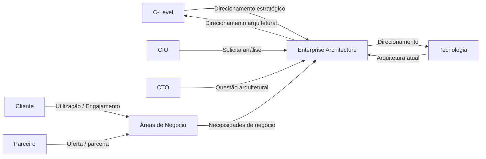
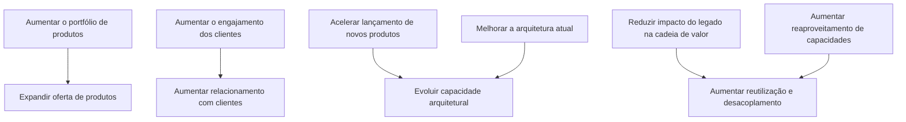
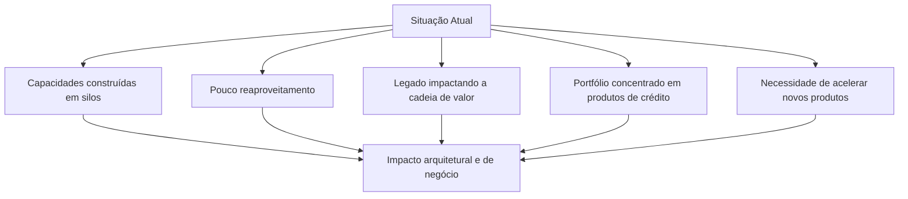
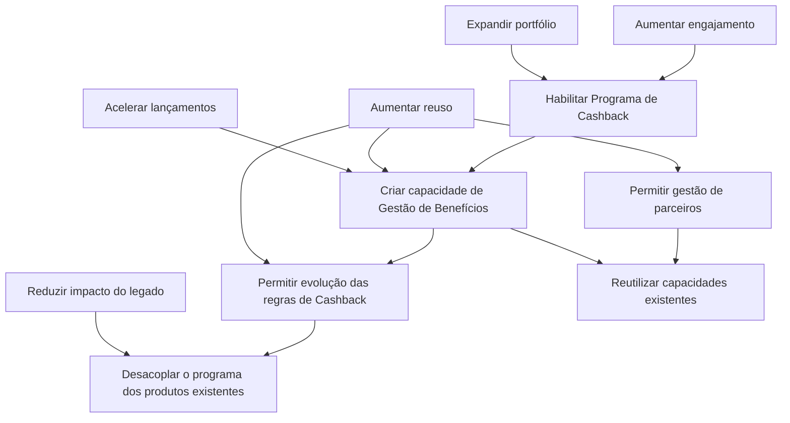
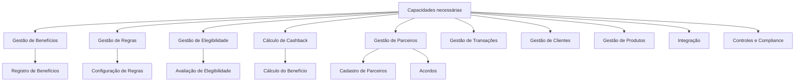
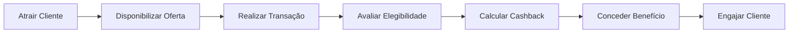
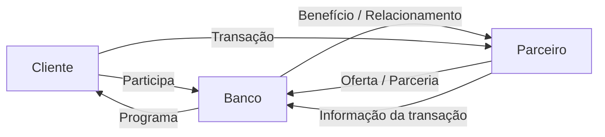
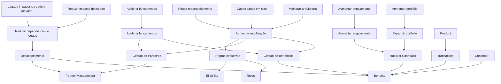
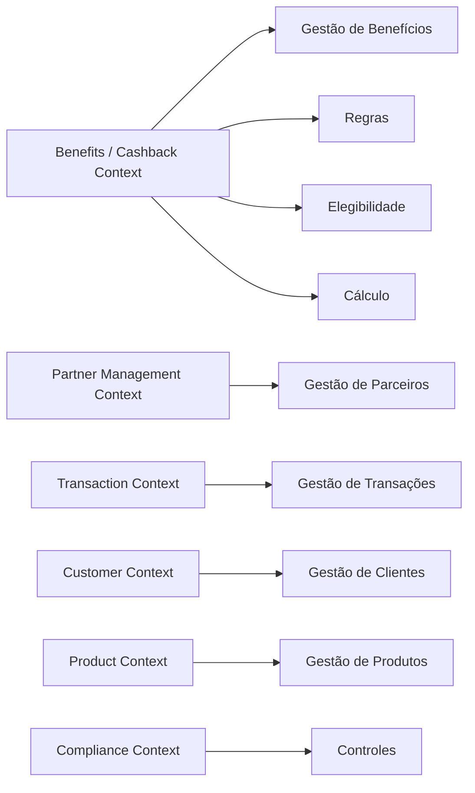

# Scenario 2 — Cashback com Parcerias
# Strategy & Motivation Layer

## 1. Objetivo

Este documento representa a camada de **Strategy & Motivation** para o cenário de **Programa de Cashback com Parcerias**, utilizando os conceitos de arquitetura estratégica associados ao TOGAF e à modelagem de motivação/estratégia.

O objetivo é estabelecer a rastreabilidade entre:

```text
Drivers
   ↓
Assessment
   ↓
Problems / Issues
   ↓
Goals
   ↓
Objectives
   ↓
Outcomes
   ↓
Capabilities
   ↓
Value Streams
```

A camada não define ainda a arquitetura tecnológica TO-BE nem uma decisão sobre aquisição de Core Bancário.

---

# 2. Evidências do Case

O case apresenta os seguintes fatos relevantes para este cenário:

- O banco deseja aumentar o portfólio de produtos e o engajamento.
- Conta de Pagamentos e Cashback com parcerias foram os produtos que apresentaram melhores resultados nos testes realizados.
- O C-level entende que ambos os produtos endereçam o problema de engajamento, mas apenas um será priorizado.
- Existe a expectativa de que o novo produto também contribua para melhorar a arquitetura atual e acelerar o lançamento de novos produtos.
- O CTO questiona se a aquisição de uma plataforma de Core Bancário poderia resolver esses problemas.
- O portfólio atual é predominantemente baseado em produtos de crédito.
- As capacidades atuais foram construídas em silos, com pouco reaproveitamento.
- O legado impacta a cadeia de valor da companhia.
- A arquitetura atual utiliza Microservices e esse estilo deve ser preservado.
- A análise deve considerar boas práticas do setor bancário.
- Elementos não aderentes devem ser tratados em uma arquitetura TO-BE e em um plano de migração.

O case identifica explicitamente o Cashback como um programa com **parcerias**, portanto a análise deste cenário considera o relacionamento entre o banco, os clientes, as transações e os parceiros.

---

# 3. Stakeholders



## 3.1 C-Level

Interesses:

- ampliar o portfólio;
- aumentar o engajamento;
- priorizar um novo produto;
- melhorar a arquitetura;
- acelerar novos lançamentos.

## 3.2 CIO

Interesse:

- garantir análise de Enterprise Architecture antes da decisão arquitetural.

## 3.3 CTO

Interesse:

- avaliar a hipótese de aquisição de uma plataforma de Core Bancário.

## 3.4 Enterprise Architecture

Responsabilidades no contexto do case:

- analisar os problemas;
- identificar capacidades;
- avaliar os cenários;
- analisar arquitetura atual;
- propor arquitetura alvo;
- avaliar alternativas arquiteturais.

## 3.5 Cliente

Interesse:

- receber benefícios;
- participar do programa;
- utilizar os produtos e parceiros elegíveis.

## 3.6 Parceiro

Interesse relacionado ao cenário:

- participar do programa;
- disponibilizar ofertas elegíveis;
- estabelecer regras comerciais com o banco.

O case não detalha o modelo comercial entre banco e parceiro. Esse ponto permanece como questão a ser validada.

---

# 4. Drivers Estratégicos



| ID | Driver | Natureza |
|---|---|---|
| D-001 | Aumentar o portfólio de produtos | Negócio |
| D-002 | Aumentar o engajamento dos clientes | Negócio |
| D-003 | Acelerar o lançamento de novos produtos | Estratégico |
| D-004 | Melhorar a arquitetura atual | Arquitetural |
| D-005 | Reduzir o impacto do legado na cadeia de valor | Arquitetural |
| D-006 | Aumentar o reaproveitamento das capacidades | Arquitetural |

---

# 5. Assessment — Situação Atual

Os problemas apresentados pelo case são:



| ID | Problema | Evidência |
|---|---|---|
| P-001 | Capacidades construídas em silos | Case |
| P-002 | Baixo reaproveitamento de capacidades | Case |
| P-003 | Legado impactando a cadeia de valor | Case |
| P-004 | Portfólio predominantemente baseado em crédito | Case |
| P-005 | Necessidade de acelerar lançamentos | Case |

---

# 6. Goals — Objetivos Estratégicos

## G-001 — Expandir o portfólio

Disponibilizar um novo produto de relacionamento baseado em Cashback e parcerias.

## G-002 — Aumentar o engajamento

Utilizar o programa de Cashback como mecanismo de relacionamento entre o banco, clientes e parceiros.

O case afirma que o Cashback está entre os produtos que apresentaram bons resultados nos testes e que os produtos avaliados endereçam o problema de engajamento.

## G-003 — Acelerar o lançamento de novos produtos

Criar condições para que novas ofertas possam reutilizar capacidades e funcionalidades existentes.

## G-004 — Aumentar o reaproveitamento

Reduzir a construção isolada de capacidades e favorecer sua utilização por diferentes produtos.

## G-005 — Reduzir o impacto do legado

Criar uma evolução arquitetural que diminua a dependência dos novos produtos em relação aos silos existentes.

---

# 7. Objectives — Cenário Cashback



---

# 8. Outcomes

Os outcomes abaixo representam resultados esperados da transformação, não resultados já comprovados.

| ID | Outcome | Relação |
|---|---|---|
| OC-001 | Programa de Cashback disponível | O-001 |
| OC-002 | Capacidade de gestão de benefícios estabelecida | O-002 |
| OC-003 | Parceiros integrados ao programa | O-003 |
| OC-004 | Regras de Cashback evoluíveis | O-004 |
| OC-005 | Capacidades existentes reutilizadas | O-005 |
| OC-006 | Menor dependência direta do legado | O-006 |
| OC-007 | Capacidade de incorporar novos parceiros sem redesenhar todo o produto | O-003/O-004 |

O último outcome é uma hipótese arquitetural derivada da necessidade de trabalhar com parceiros e deve ser validado posteriormente.

---

# 9. Capabilities Estratégicas

Para o cenário de Cashback:



## Capacidades relevantes

| Capacidade | Papel no cenário |
|---|---|
| Gestão de Benefícios | Capacidade central do programa |
| Gestão de Regras | Determina as condições de concessão |
| Gestão de Elegibilidade | Determina se cliente/transação são elegíveis |
| Cálculo de Cashback | Determina o valor do benefício |
| Gestão de Parceiros | Administra participantes do ecossistema |
| Gestão de Transações | Fornece informações relevantes para avaliação |
| Gestão de Clientes | Identifica o cliente |
| Gestão de Produtos | Identifica produtos relacionados |
| Integração | Permite comunicação com sistemas internos e parceiros |
| Controles e Compliance | Suporta controles aplicáveis |

---

# 10. Value Stream

Um fluxo de valor candidato para o cenário é:



Em uma visão simplificada:

```text
Atrair
   ↓
Ofertar
   ↓
Transacionar
   ↓
Avaliar
   ↓
Calcular
   ↓
Conceder
   ↓
Engajar
```

Esse fluxo é uma hipótese inicial e deverá ser refinado com as regras reais do programa.

---

# 11. Ecossistema do Value Stream

O cenário possui uma característica adicional em relação à Conta de Pagamentos: a presença de parceiros.



O fluxo real de integração dependerá do modelo comercial e operacional definido para o programa.

O case não especifica como as transações dos parceiros serão disponibilizadas ao banco. Portanto, esse aspecto permanece em aberto.

---

# 12. Strategy & Motivation Consolidada



---

# 13. Relação com Bounded Contexts

Os Bounded Contexts identificados anteriormente podem ser associados às capacidades estratégicas:



O `Benefits / Cashback Context` aparece como o principal contexto específico do cenário.

Isso não significa que ele já deva ser transformado diretamente em um único Microservice.

---

# 14. Relação com os Requisitos

| Requisito | Elemento estratégico |
|---|---|
| Disponibilizar programa de Cashback | Habilitar Cashback |
| Cadastro e gestão de parceiros | Gestão de Parceiros |
| Definir regras de Cashback | Gestão de Regras |
| Calcular Cashback | Cálculo de Cashback |
| Registrar Cashback | Gestão de Benefícios |
| Integrar com produtos existentes | Reutilização de capacidades |
| Integrar com parceiros | Gestão de Integrações |
| Permitir interoperabilidade | Evolução arquitetural |
| Manter Microservices | Restrição arquitetural |
| Acelerar lançamento de produtos | Objetivo estratégico |
| Reduzir dependência do legado | Objetivo arquitetural |

---

# 15. Hipóteses Arquiteturais

### H-001 — Contexto próprio para benefícios

O programa de Cashback deve possuir uma fronteira de negócio própria para evitar que suas regras sejam incorporadas diretamente aos produtos existentes.

### H-002 — Regras separadas dos produtos

As regras de elegibilidade e cálculo devem permanecer desacopladas dos produtos que originam as transações.

### H-003 — Parceiros possuem contexto próprio

As informações e responsabilidades relacionadas aos parceiros devem ser separadas das regras internas de Cashback.

### H-004 — Transação como fonte de informação

O contexto de Cashback pode consumir informações de transações sem necessariamente assumir a propriedade do domínio de transações.

### H-005 — Integração com parceiros isolada

As particularidades de cada parceiro devem ser isoladas por contratos e mecanismos de integração.

### H-006 — Core Bancário como alternativa

A eventual aquisição de Core Bancário deve ser avaliada em relação às capacidades necessárias e não assumida como solução prévia.

---

# 16. Questões em Aberto

1. O que caracteriza uma transação elegível?
2. Quais produtos podem gerar Cashback?
3. Quem define as regras?
4. Como as regras serão configuradas?
5. Qual é a unidade de cálculo do Cashback?
6. Quando o benefício é considerado concedido?
7. Como são tratados cancelamentos?
8. Como são tratados estornos?
9. Como ocorre a liquidação financeira?
10. Quem financia o Cashback?
11. Como ocorre a reconciliação com os parceiros?
12. Quais informações os parceiros disponibilizam?
13. Como novos parceiros serão incorporados?
14. Quais capacidades existentes podem ser reutilizadas?
15. Quais capacidades poderiam ser fornecidas por um Core Bancário?
16. Quais capacidades devem permanecer no banco?
17. Quais requisitos regulatórios e de segurança se aplicam?
18. Qual arquitetura intermediária será necessária?

---

# 17. Rastreabilidade

A visão estratégica pode ser resumida em:

```text
Driver
  │
  ├── Aumentar portfólio
  │       ↓
  │   Programa de Cashback
  │
  ├── Aumentar engajamento
  │       ↓
  │   Benefícios + Parceiros
  │
  ├── Acelerar lançamentos
  │       ↓
  │   Capacidades reutilizáveis
  │
  └── Reduzir impacto do legado
          ↓
      Desacoplamento
          ↓
      Arquitetura TO-BE
```

---

# 18. Próxima etapa

A evolução recomendada para o cenário é:

```text
Strategy & Motivation
        ↓
Business Architecture
        ↓
Capabilities
        ↓
Value Streams
        ↓
Business Functions
        ↓
Bounded Contexts / Context Map
        ↓
Application Architecture
        ↓
Building Blocks
        ↓
Microservices
        ↓
Technology Architecture
        ↓
Migration Planning
```

A análise do cenário permanece sem conclusão sobre sua priorização frente à Conta de Pagamentos.

O objetivo deste documento é estabelecer a motivação estratégica e a cadeia de rastreabilidade necessária para as próximas fases da arquitetura.
