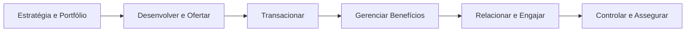
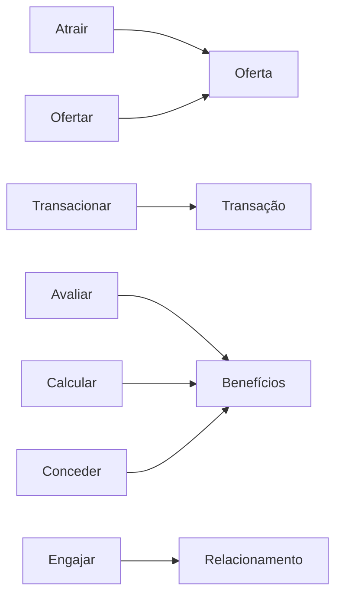
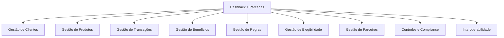
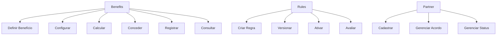
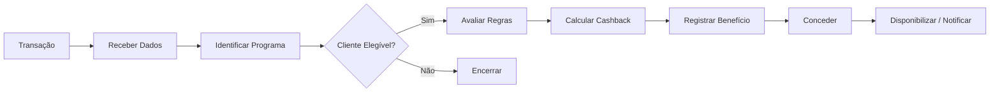
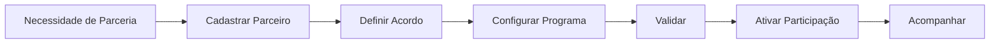
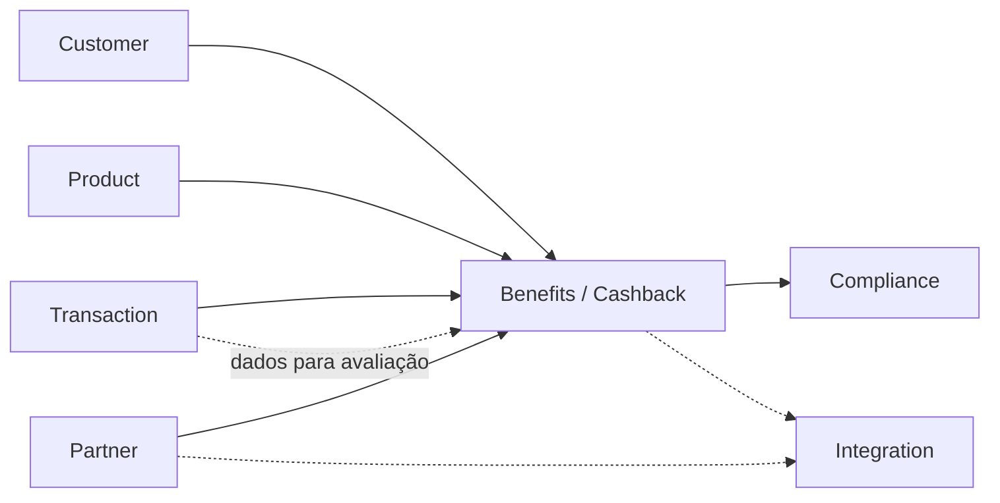
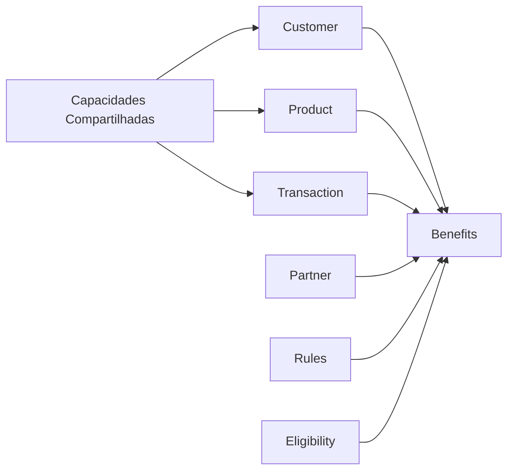

# Business Architecture — Cenário 2: Cashback com Parcerias

## 1. Objetivo

Este documento explora a camada de **Business Architecture** para o cenário de Cashback com Parcerias.

A Strategy & Motivation já foi definida separadamente e não é alterada aqui.

O objetivo é detalhar:

- atores e stakeholders;
- Value Chain;
- Business Functions;
- capacidades;
- serviços de negócio;
- processos;
- objetos de negócio;
- relações entre contextos;
- interoperabilidade;
- impacto do legado;
- gaps;
- oportunidades de evolução.

A modelagem é derivada do case. O processo operacional real do banco não foi fornecido e, portanto, as partes não informadas são hipóteses arquiteturais.

---

# 2. Entrada da Business Architecture

A Strategy & Motivation deste cenário estabelece o Cashback com Parcerias como uma possibilidade de expansão de portfólio e engajamento.

O Value Stream já definido é utilizado como entrada:

```text
Atrair → Ofertar → Transacionar → Avaliar → Calcular → Conceder → Engajar
```

A Business Architecture detalha as capacidades necessárias para suportar esse fluxo.

---

# 3. Stakeholders de Negócio

| Stakeholder | Interesse |
|---|---|
| Cliente | Receber e utilizar benefícios |
| Banco | Aumentar engajamento e portfólio |
| C-level | Expansão de produto |
| Produto | Definir programa e regras |
| Parceiro | Participar do programa |
| Operações | Operar benefícios e parceiros |
| Compliance | Aplicar controles |
| Tecnologia | Implementar integração e evolução |
| Enterprise Architecture | Garantir evolução arquitetural |

Responsabilidades específicas além das explicitamente mencionadas no case são hipóteses.

---

# 4. Value Chain



O trecho específico do cenário é:

```text
Desenvolver Oferta
      ↓
Transacionar
      ↓
Avaliar Elegibilidade
      ↓
Calcular Benefício
      ↓
Conceder Benefício
      ↓
Engajar Cliente
```

---

# 5. Value Stream × Value Chain

O Value Stream já definido na Strategy & Motivation pode ser relacionado à Value Chain:



A relação é uma modelagem conceitual para conectar valor e capacidades.

---

# 6. Capacidades de Negócio



As capacidades específicas mais importantes são:

```text
Gestão de Benefícios
Gestão de Regras
Gestão de Elegibilidade
Gestão de Parceiros
```

---

# 7. Decomposição das Capacidades

## 7.1 Gestão de Benefícios

Funções:

- definir benefício;
- configurar benefício;
- conceder benefício;
- registrar benefício;
- consultar benefício;
- acompanhar estado.

## 7.2 Gestão de Regras

Funções:

- criar regra;
- alterar regra;
- ativar/desativar regra;
- avaliar regra;
- versionar regra.

## 7.3 Gestão de Elegibilidade

Funções:

- identificar programa;
- identificar cliente elegível;
- avaliar condições;
- determinar elegibilidade;
- registrar decisão.

## 7.4 Gestão de Parceiros

Funções:

- cadastrar parceiro;
- manter parceiro;
- administrar acordos;
- configurar participação;
- controlar status;
- integrar com parceiro.

## 7.5 Gestão de Transações

Funções:

- receber transação;
- identificar origem;
- validar;
- disponibilizar dados;
- registrar;
- consultar.

---

# 8. Business Functions



Essas funções representam o negócio, não componentes tecnológicos.

---

# 9. Serviços de Negócio

| Business Service | Capacidade |
|---|---|
| Serviço de Gestão de Programa | Benefícios |
| Serviço de Elegibilidade | Elegibilidade |
| Serviço de Avaliação de Regras | Regras |
| Serviço de Cálculo de Cashback | Benefícios |
| Serviço de Concessão | Benefícios |
| Serviço de Gestão de Parceiro | Parceiros |
| Serviço de Integração com Parceiro | Parceiros / Integração |
| Serviço de Consulta de Benefício | Benefícios |

Esses serviços não são automaticamente Microservices.

---

# 10. Processo de Negócio — Concessão de Cashback



Este é um processo macro proposto, não o processo operacional atual do banco.

---

# 11. Processo de Negócio — Gestão de Parceiro



---

# 12. Objetos de Negócio

Objetos conceituais:

```text
Cliente
Produto
Transação
Programa de Cashback
Benefício
Regra
Elegibilidade
Parceiro
Acordo
Evento de Benefício
```

A modelagem de entidades, agregados e invariantes pertence à camada tática de DDD.

---

# 13. Relação com Bounded Contexts



O Context Map completo está documentado separadamente.

---

# 14. Interoperabilidade

O Cashback possui uma característica importante: o benefício depende de informações externas ao próprio contexto de benefícios.

Conceitualmente:

```text
Transação
    ↓
Identificação
    ↓
Elegibilidade
    ↓
Regras
    ↓
Cálculo
    ↓
Benefício
```

Além disso:

```text
Parceiro
    ↓
Integração
    ↓
Programa de Cashback
```

Isso exige contratos claros entre contextos.

---

# 15. Impacto do Legado

O case informa que o legado impacta a cadeia de valor.

Para Cashback, os pontos de investigação são:

```text
Transaction
    ↓
Benefits
    ↓
Partner
```

e:

```text
Legacy
    ↓
Dados / capacidades existentes
    ↓
Cashback
```

Perguntas:

- Como obter os dados das transações?
- Existe uma capacidade transacional reutilizável?
- Como o banco identifica o parceiro?
- Onde ficam as regras?
- Existe infraestrutura de benefícios?
- Como ocorre a concessão?
- Como ocorre reversão?
- Como ocorre conciliação?
- O legado precisa conhecer Cashback?
- O Cashback pode permanecer desacoplado do legado?

O case não fornece essas respostas.

---

# 16. Gap de Business Architecture

| Tema | Situação conhecida | Gap |
|---|---|---|
| Portfólio | Forte concentração em crédito | Criar nova proposta de valor |
| Reuso | Pouco reaproveitamento | Reutilizar capacidades transversais |
| Benefícios | Não informado como capacidade existente | Criar/avaliar capacidade |
| Regras | Não informado | Definir capacidade |
| Elegibilidade | Não informado | Definir capacidade |
| Parceiros | Necessidade do cenário | Definir capacidade |
| Transações | Necessárias | Avaliar capacidade existente |
| Legado | Impacta cadeia de valor | Isolar dependências |
| Integrações | Necessárias | Definir contratos |

---

# 17. Oportunidades

A Business Architecture sugere:

1. separar Benefits de produtos existentes;
2. manter regras evolutivas fora dos produtos;
3. tratar Partner como contexto próprio;
4. utilizar Transaction como fonte de informação;
5. evitar que parceiros conheçam detalhes internos do banco;
6. criar contratos de integração;
7. criar Building Blocks reutilizáveis para futuros programas de benefícios.

Essas oportunidades ainda não representam a arquitetura TO-BE definitiva.

---

# 18. Potencial de Reuso

O cenário pode utilizar capacidades compartilhadas:

```text
Customer
Product
Transaction
Compliance
Integration
```

e acrescentar:

```text
Benefits
Rules
Eligibility
Partner
```

Isso cria uma estrutura conceitual:



A hipótese é que os elementos compartilhados possam ser reutilizados em outros produtos.

---

# 19. Critérios para Comparação Posterior

O cenário deverá ser comparado à Conta de Pagamentos considerando:

- capacidade de reutilização;
- quantidade de novas capacidades;
- dependência do legado;
- complexidade de integração;
- capacidade de gerar Building Blocks;
- impacto na cadeia de valor;
- evolução de regras;
- integração com parceiros;
- complexidade operacional;
- aderência ao estilo Microservices;
- potencial de acelerar novos produtos.

---

# 20. Rastreabilidade

```text
Strategy & Motivation
        ↓
Cashback + Parcerias
        ↓
Value Stream
        ↓
Value Chain
        ↓
Capabilities
        ↓
Business Functions
        ↓
Business Services
        ↓
Business Processes
        ↓
Bounded Contexts
        ↓
Context Map
```

---

# 21. Limitações

Este documento não afirma:

- que Benefits já existe no banco;
- que Rules já existe;
- que Eligibility já existe;
- que Partner Management já existe;
- que os processos apresentados são os processos atuais;
- que determinados sistemas ou APIs existem;
- que o legado possui determinada interface;
- que o Core Bancário é necessário;
- que Cashback deve ser escolhido.

Esses pontos dependem das etapas seguintes de análise.

