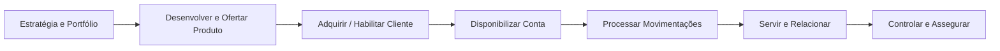
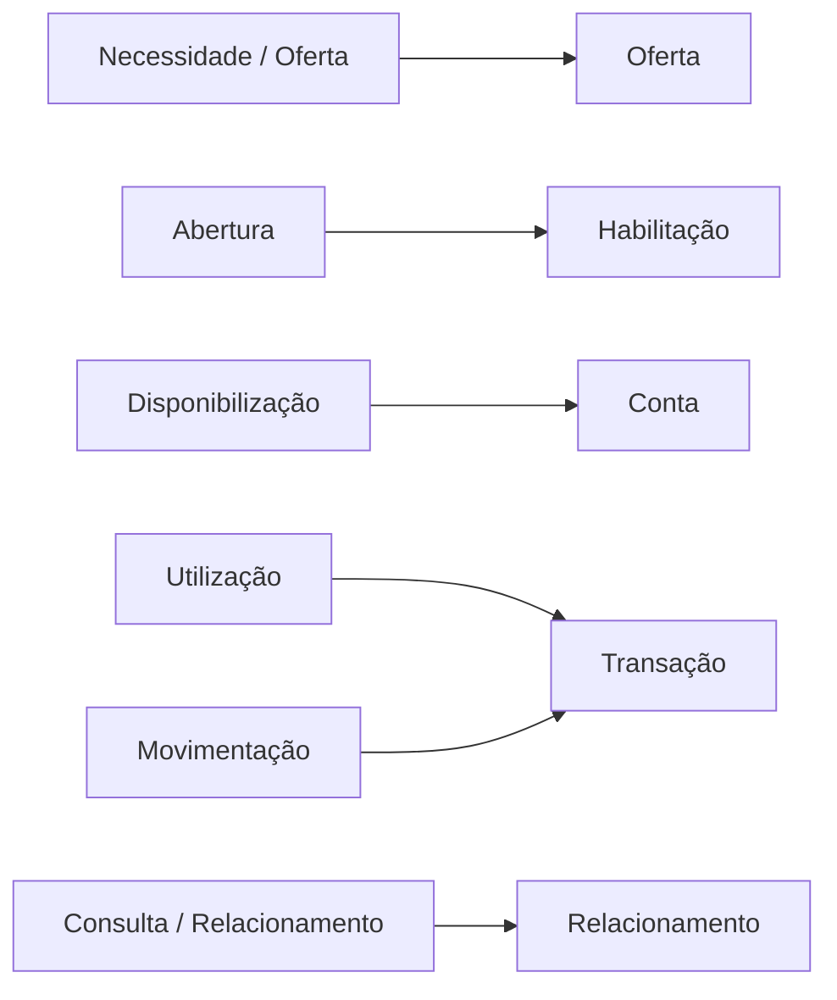
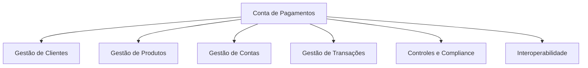
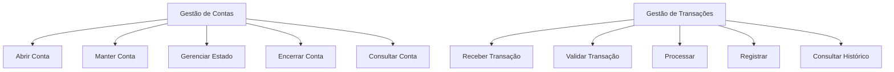
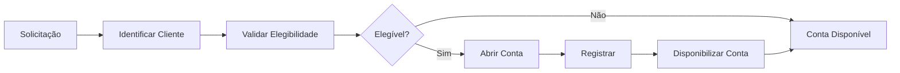
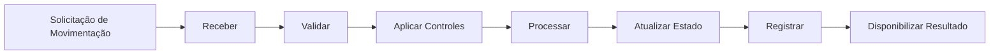
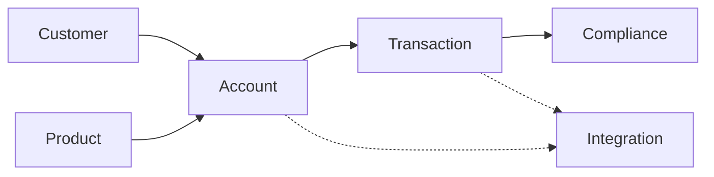

# Business Architecture — Cenário 1: Conta de Pagamentos

## 1. Objetivo

Este documento explora a camada de **Business Architecture** para o cenário de Conta de Pagamentos.

A Strategy & Motivation já foi definida separadamente e não é alterada aqui. Este documento recebe aquela camada como entrada e detalha:

- atores e stakeholders de negócio;
- Value Chain;
- Business Functions;
- capacidades;
- serviços de negócio;
- processos de negócio;
- objetos de negócio;
- relação com os Bounded Contexts;
- interoperabilidade;
- impacto do legado;
- gaps arquiteturais;
- oportunidades de evolução.

A arquitetura apresentada é uma **modelagem arquitetural derivada do case**. O case não fornece o processo operacional real do banco, portanto processos e capacidades não explicitamente informados são hipóteses a validar.

---

# 2. Entrada da Business Architecture

A Strategy & Motivation deste cenário estabelece como objetivo habilitar a Conta de Pagamentos dentro de uma estratégia de ampliação do portfólio e evolução arquitetural.

O Value Stream já definido para o cenário é utilizado como entrada desta camada.

```text
Disponibilizar / Utilizar Conta
```

A Business Architecture detalha quais capacidades e funções são necessárias para executar esse fluxo de valor.

---

# 3. Stakeholders de Negócio

| Stakeholder | Interesse no cenário |
|---|---|
| Cliente | Abrir e utilizar a conta |
| C-level | Ampliação do portfólio e engajamento |
| Produto | Definir e evoluir a Conta de Pagamentos |
| Operações | Operar a jornada da conta |
| Compliance | Garantir controles aplicáveis |
| Tecnologia | Implementar e evoluir a solução |
| Enterprise Architecture | Garantir aderência arquitetural e evolução |
| Sistemas legados | Fornecer ou consumir capacidades existentes |

A existência e responsabilidades específicas de cada stakeholder além do C-level, CIO e CTO são hipóteses organizacionais.

---

# 4. Value Chain

A Value Chain representa os grandes agrupamentos de atividades por meio dos quais o banco cria e entrega valor.



Para o cenário, o trecho mais diretamente relacionado ao novo produto é:

```text
Desenvolver / Ofertar
        ↓
Habilitar Cliente
        ↓
Disponibilizar Conta
        ↓
Processar Movimentações
        ↓
Servir / Relacionar
```

---

# 5. Value Stream × Value Chain

O Value Stream do cenário deve atravessar a Value Chain.



Esta relação é conceitual. Ela permite rastrear o valor desde a estratégia até as capacidades.

---

# 6. Capacidades de Negócio

As capacidades relevantes são:



## 6.1 Gestão de Clientes

Responsável por disponibilizar informações necessárias para identificar e relacionar o cliente à conta.

Funções candidatas:

- identificar cliente;
- consultar cliente;
- associar cliente a produto;
- manter dados relevantes.

## 6.2 Gestão de Produtos

Funções candidatas:

- definir produto;
- configurar produto;
- administrar ciclo de vida;
- parametrizar oferta.

## 6.3 Gestão de Contas

É a capacidade específica mais diretamente relacionada ao cenário.

Funções:

- abertura;
- manutenção;
- alteração de estado;
- bloqueio/desbloqueio;
- encerramento;
- consulta.

## 6.4 Gestão de Transações

Funções:

- receber movimentação;
- validar;
- processar;
- registrar;
- atualizar estado;
- consultar histórico.

## 6.5 Controles e Compliance

Funções candidatas:

- validar controles;
- registrar evidências;
- monitorar operações;
- suportar auditoria.

## 6.6 Interoperabilidade

Funções:

- integração com capacidades existentes;
- integração com legado;
- exposição/consumo de contratos;
- tradução de modelos quando necessário.

---

# 7. Business Functions

As capacidades são decompostas em funções de negócio.



Business Function não significa necessariamente uma operação técnica ou um Microservice.

---

# 8. Serviços de Negócio

Uma forma de transformar capacidades em serviços de negócio é:

| Business Service | Capacidade |
|---|---|
| Serviço de Abertura de Conta | Gestão de Contas |
| Serviço de Manutenção de Conta | Gestão de Contas |
| Serviço de Movimentação | Gestão de Transações |
| Serviço de Consulta de Saldo | Gestão de Transações |
| Serviço de Extrato | Gestão de Transações |
| Serviço de Gestão de Cliente | Gestão de Clientes |
| Serviço de Controles | Compliance |

Esses são serviços de negócio, não necessariamente APIs ou Microservices.

---

# 9. Processo de Negócio — Abertura



O processo é uma proposta de modelagem macro; o case não fornece o processo operacional detalhado.

---

# 10. Processo de Negócio — Movimentação



---

# 11. Objetos de Negócio

Objetos conceituais:

```text
Cliente
Produto
Conta de Pagamentos
Transação
Saldo
Extrato
Status da Conta
Regra de Elegibilidade
Controle
```

O modelo detalhado de entidades, agregados e invariantes pertence à camada tática de DDD e não deve ser antecipado aqui.

---

# 12. Relação com Bounded Contexts



A relação demonstra como as funções de negócio podem ser organizadas semanticamente.

---

# 13. Interoperabilidade

O cenário depende de interoperabilidade com capacidades existentes.

A arquitetura de negócio deve buscar:

```text
Novo produto
    ↓
Capacidades reutilizáveis
    ↓
Contratos explícitos
    ↓
Integração
    ↓
Legado
```

Em vez de:

```text
Novo produto
    ↓
Acoplamento direto
    ↓
Legado
```

A segunda situação representa uma hipótese de risco arquitetural a evitar.

---

# 14. Impacto do Legado

O case informa que o legado impacta a cadeia de valor.

Para Conta de Pagamentos, os principais pontos de investigação são:

```text
Gestão de Clientes
       ↓
Gestão de Contas
       ↓
Gestão de Transações
       ↓
Legado
```

Perguntas de arquitetura:

- Existe capacidade de conta reutilizável?
- Existe capacidade transacional reutilizável?
- Onde estão os dados da conta?
- Quem é o sistema de registro?
- O legado exige acoplamento?
- Existe contrato de integração?
- A introdução de um Core Bancário substituiria ou apenas deslocaria essas dependências?

O case não responde essas perguntas.

---

# 15. Gap de Business Architecture

| Tema | Situação conhecida | Gap |
|---|---|---|
| Portfólio | Predominantemente crédito | Nova capacidade de conta |
| Reuso | Pouco reaproveitamento | Identificar capacidades reutilizáveis |
| Silos | Existentes | Definir limites de negócio |
| Legado | Impacta cadeia de valor | Reduzir acoplamento |
| Transações | Necessárias ao cenário | Validar capacidade existente |
| Conta | Necessária ao novo produto | Validar existência/reuso |
| Interoperabilidade | Necessária | Definir contratos |

---

# 16. Oportunidades

A Business Architecture sugere algumas oportunidades:

1. tratar Account como capacidade de negócio explicitamente delimitada;
2. separar capacidade de conta de capacidades transversais;
3. reutilizar Customer, Product e Transaction quando existentes;
4. reduzir dependências diretas do legado;
5. criar contratos de negócio claros;
6. transformar capacidades reutilizáveis em Building Blocks posteriormente.

Essas oportunidades não constituem ainda a arquitetura TO-BE.

---

# 17. Critérios para a Comparação Posterior

O cenário deve ser comparado ao Cashback considerando:

- quantidade de capacidades novas;
- quantidade de capacidades potencialmente reutilizáveis;
- dependência de capacidades legadas;
- impacto na cadeia de valor;
- quantidade de integrações;
- capacidade de gerar Building Blocks reutilizáveis;
- complexidade de evolução;
- aderência ao estilo Microservices;
- impacto da eventual adoção de Core Bancário.

---

# 18. Rastreabilidade

```text
Estratégia
    ↓
Aumentar portfólio / engajamento
    ↓
Conta de Pagamentos
    ↓
Value Stream
    ↓
Capacidades
    ↓
Business Functions
    ↓
Business Services
    ↓
Processos
    ↓
Bounded Contexts
```

---

# 19. Limitações

Este documento não afirma:

- que as capacidades já existem;
- que os processos apresentados são os processos atuais do banco;
- que existem determinados sistemas;
- que existem determinados Microservices;
- que um Core Bancário é necessário;
- que a Conta de Pagamentos deve ser escolhida.

Esses pontos dependem das etapas seguintes de análise.

