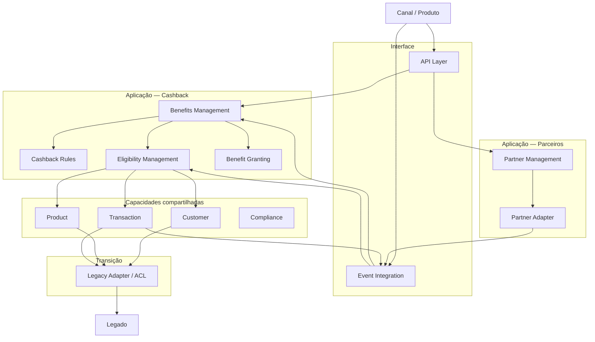

# Implementation Architecture — TOGAF ADM Fase E / G

## 1. Objetivo

Este documento materializa a decisão arquitetural do cenário de Cashback com Parcerias em uma visão de implementação.

No ciclo TOGAF ADM, esta etapa está principalmente relacionada à:

- **Fase E — Opportunities & Solutions:** identificação dos pacotes de trabalho, Building Blocks e abordagem de implementação;
- **Fase G — Implementation Governance:** orientação e governança da implementação para assegurar aderência à arquitetura.

A Fase F, dedicada ao planejamento da migração, é tratada no documento `migration-plan.md`.

A separação é intencional: Fase E define a solução e os pacotes de trabalho; Fase F organiza a transição; Fase G governa a realização.

---

## 2. Entradas

Este documento utiliza como entradas:

- ADR-002 — decisão do cenário de transformação;
- Estrangulamentos, TO-BE e Arquitetura Intermediária;
- Building Blocks — Cashback com Parcerias;
- Business Architecture do cenário;
- Bounded Contexts candidatos;
- requisitos funcionais e não funcionais.

A solução deve preservar o estilo arquitetural Microservices definido no caso.

---

# 3. Fase E — Opportunities & Solutions

## 3.1 Objetivo da oportunidade

Utilizar Cashback com Parcerias como primeiro veículo de evolução arquitetural para:

- aumentar a reutilização de capacidades;
- reduzir a formação de novos silos;
- reduzir o acoplamento com o legado;
- criar capacidades reutilizáveis;
- permitir evolução mais independente de regras e benefícios;
- estabelecer uma base para novos produtos.

A decisão não afirma que Cashback possui maior valor comercial que Conta de Pagamentos. A escolha decorre do papel arquitetural definido na ADR-002.

---

## 3.2 Solution Building Blocks

Os principais Solution Building Blocks candidatos são:

### Capacidades compartilhadas

- Customer Management;
- Product Management;
- Transaction Management;
- Compliance.

### Cashback

- Benefits Management;
- Cashback Rules;
- Eligibility Management;
- Benefit Granting.

### Parceiros

- Partner Management;
- Partner Integration Adapter.

### Integração

- API Layer;
- Event Integration;
- Legacy Adapter / ACL.

---

## 3.3 Pacotes de trabalho

| Work Package | Objetivo | Building Blocks |
|---|---|---|
| WP-01 — Isolamento | Criar fronteira entre novo domínio e legado | Legacy Adapter / ACL |
| WP-02 — Contratos | Definir interfaces de integração | API Layer / Events |
| WP-03 — Benefits | Introduzir domínio de benefícios | Benefits |
| WP-04 — Rules | Separar regras de negócio | Rules |
| WP-05 — Eligibility | Formalizar decisão de elegibilidade | Eligibility |
| WP-06 — Partner | Estruturar parceiros | Partner Management |
| WP-07 — Partner Integration | Encapsular integrações externas | Partner Adapter |
| WP-08 — Reuso | Consolidar consumo de capacidades existentes | Customer / Product / Transaction |
| WP-09 — Evolução | Reduzir dependências legadas | ACL + migração gradual |

---

# 4. Arquitetura de Implementação



Este desenho é uma visão de implementação e não representa ainda o desenho físico de infraestrutura.

---

# 5. Realização dos Building Blocks

## 5.1 Benefits Management

Realiza a capacidade de gerenciamento dos benefícios.

Responsabilidades principais:

- identificar benefício;
- calcular benefício;
- registrar benefício;
- disponibilizar benefício;
- consultar histórico.

---

## 5.2 Cashback Rules

Realiza o gerenciamento das regras.

Responsabilidades:

- criação;
- alteração;
- ativação;
- desativação;
- versionamento;
- avaliação.

---

## 5.3 Eligibility Management

Realiza a decisão de elegibilidade.

Fluxo conceitual:

```text
Transaction
     ↓
Identificação do contexto
     ↓
Consulta Customer / Product
     ↓
Consulta Rules
     ↓
Avaliação
     ↓
Eligibility Decision
```

---

## 5.4 Partner Management

Realiza o gerenciamento do relacionamento com parceiros.

Fluxo:

```text
Partner
   ↓
Cadastro
   ↓
Acordo
   ↓
Configuração
   ↓
Ativação
   ↓
Operação
```

---

# 6. Contratos de Implementação

Os contratos devem ser definidos antes da decomposição final dos Microservices.

## Contratos síncronos candidatos

- consultar cliente;
- consultar produto;
- consultar benefício;
- consultar elegibilidade;
- consultar parceiro;
- administrar regras.

## Eventos candidatos

- `TransactionOccurred`;
- `CashbackEligibilityEvaluated`;
- `CashbackCalculated`;
- `CashbackGranted`;
- `PartnerUpdated`.

Os nomes são conceituais e deverão ser validados durante o desenho detalhado.

---

# 7. Application Architecture

A relação entre capacidades e componentes de aplicação pode ser representada inicialmente assim:

```text
Business Capability
        ↓
Building Block
        ↓
Application Component
        ↓
API / Event
        ↓
Implementation
```

Exemplo:

```text
Benefits Management
        ↓
Benefits Component
        ↓
Benefits API / Events
        ↓
Implementação
```

A quantidade definitiva de componentes deve ser validada no DDD tático.

---

# 8. Microservices

A arquitetura mantém Microservices como estilo arquitetural, conforme requisito do caso.

Entretanto:

**não é decisão deste documento afirmar que cada Building Block será um Microservice.**

A decomposição será realizada considerando:

- bounded contexts;
- autonomia;
- coesão;
- ownership dos dados;
- consistência;
- evolução;
- escala;
- dependências;
- contratos.

---

# 9. Fase G — Implementation Governance

A implementação deve ser governada pela arquitetura.

## Gates arquiteturais

### Gate 1 — Domínio

Validar:

- bounded contexts;
- responsabilidades;
- linguagem ubíqua;
- regras de negócio.

### Gate 2 — Integração

Validar:

- contratos;
- APIs;
- eventos;
- dependências;
- ACLs.

### Gate 3 — Implementação

Validar:

- aderência aos Building Blocks;
- isolamento do legado;
- princípios de Microservices;
- requisitos não funcionais.

### Gate 4 — Transição

Validar:

- coexistência;
- critérios de entrada;
- critérios de saída;
- rollback;
- redução de dependências.

---

# 10. Critérios de aderência

Uma implementação é aderente quando:

- preserva Microservices;
- não cria duplicação desnecessária;
- utiliza capacidades compartilhadas;
- mantém o legado isolado;
- respeita contratos;
- mantém responsabilidades de domínio explícitas;
- permite evolução incremental;
- possui rastreabilidade até requisitos e decisões arquiteturais.

---

# 11. Relação com TOGAF ADM

```text
Fase E — Opportunities & Solutions
        │
        ├── Solution Building Blocks
        ├── Work Packages
        ├── Transition Architectures
        └── Implementation approach
                │
                ▼
Fase F — Migration Planning
        │
        ├── Prioridades
        ├── Roadmap
        ├── Dependências
        └── Plano de migração
                │
                ▼
Fase G — Implementation Governance
        │
        ├── Compliance
        ├── Architecture Contracts
        ├── Architecture Reviews
        └── Governança
                │
                ▼
Fase H — Architecture Change Management
        │
        └── Mudanças futuras
```

---

# 12. Rastreabilidade

```text
Problemas de negócio
        ↓
Capabilities
        ↓
Estrangulamentos
        ↓
ADR-002
        ↓
TO-BE
        ↓
Building Blocks
        ↓
Solution Building Blocks
        ↓
Work Packages
        ↓
Implementation
        ↓
Governance
```

---

# 13. Limitações

O caso não fornece:

- inventário completo de aplicações;
- tecnologias atuais;
- contratos existentes;
- volumes;
- SLAs;
- topologia de infraestrutura;
- custos;
- capacidade detalhada de eventual Core Banking.

Portanto, a arquitetura de implementação permanece em nível de Enterprise/Application Architecture. Detalhes tecnológicos devem ser definidos em fases posteriores.

---

# 14. Próximo artefato

O próximo artefato é a **Fase F — Migration Planning**, contendo:

- arquiteturas intermediárias;
- work packages;
- dependências;
- sequência;
- roadmap;
- riscos;
- critérios de transição;
- benefícios esperados;
- governança da migração.
