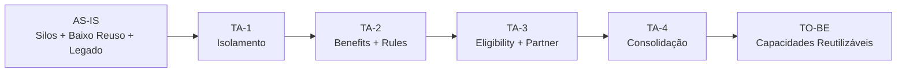
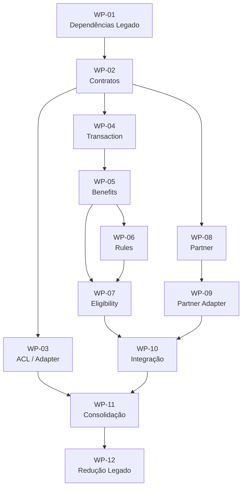
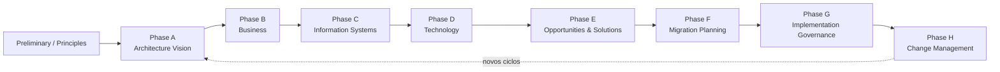

# Migration Plan — TOGAF ADM Fase F

## 1. Objetivo

Este documento transforma a arquitetura intermediária em um plano de migração.

Na lógica do TOGAF ADM, a Fase F — Migration Planning — utiliza a arquitetura alvo, as arquiteturas de transição e os pacotes de trabalho para construir uma abordagem de migração.

O objetivo é demonstrar como o banco pode evoluir do AS-IS para o TO-BE sem exigir uma transformação de uma única etapa.

---

# 2. Entradas

- Architecture Vision;
- Business Architecture;
- ADR-002;
- Estrangulamentos;
- TO-BE;
- Arquiteturas Intermediárias;
- Building Blocks;
- Solution Building Blocks;
- requisitos funcionais e não funcionais;
- restrição de manutenção do estilo Microservices.

---

# 3. Estado atual

O AS-IS utilizado no planejamento possui as seguintes características documentadas pelo caso:

- capacidades construídas em silos;
- pouco reuso;
- legado impactando a cadeia de valor;
- portfólio predominantemente relacionado a crédito;
- arquitetura baseada em Microservices.

O inventário detalhado de sistemas não foi fornecido pelo caso e, portanto, não é presumido.

---

# 4. Estado alvo

O TO-BE busca:

- Benefits como capacidade explícita;
- Rules desacopladas;
- Eligibility explícita;
- Partner como capacidade própria;
- Customer/Product/Transaction reutilizáveis;
- integração por contratos;
- legado isolado;
- Microservices preservados;
- Building Blocks reutilizáveis.

---

# 5. Arquiteturas de Transição

## TA-1 — Isolamento

Objetivo:

Criar as fronteiras necessárias para impedir que o novo domínio dependa diretamente dos detalhes do legado.

Entregas:

- ACL/Adapter;
- contratos iniciais;
- pontos de integração identificados;
- dependências documentadas.

Critério de saída:

> Cashback consegue evoluir sem incorporar diretamente o modelo interno do legado.

---

## TA-2 — Benefits + Rules

Objetivo:

Introduzir o domínio de benefícios.

Entregas:

- Benefits Management;
- Cashback Rules;
- integração com Transaction;
- contratos iniciais.

Critério de saída:

> O cálculo e as regras de Cashback deixam de depender diretamente de uma implementação específica do produto.

---

## TA-3 — Eligibility + Partner

Objetivo:

Completar a estrutura de domínio do cenário escolhido.

Entregas:

- Eligibility Management;
- Partner Management;
- Partner Adapter;
- integração com Benefits.

Critério de saída:

> O fluxo de Cashback consegue avaliar elegibilidade e operar com parceiros por meio de contratos controlados.

---

## TA-4 — Consolidação

Objetivo:

Aproximar o ambiente do TO-BE.

Entregas:

- Building Blocks consolidados;
- redução de dependências legadas;
- contratos estabilizados;
- ampliação do reuso.

Critério de saída:

> O cenário passa a operar sobre capacidades reutilizáveis e com o legado isolado.

---

# 6. Roadmap



---

# 7. Work Packages

| ID | Work Package | Transição | Dependência |
|---|---|---|---|
| WP-01 | Mapear dependências do legado | TA-1 | AS-IS |
| WP-02 | Definir contratos | TA-1 | WP-01 |
| WP-03 | Implementar ACL/Adapter | TA-1 | WP-02 |
| WP-04 | Disponibilizar Transaction para Cashback | TA-2 | WP-02 |
| WP-05 | Implementar Benefits | TA-2 | WP-04 |
| WP-06 | Implementar Rules | TA-2 | WP-05 |
| WP-07 | Implementar Eligibility | TA-3 | WP-05 + WP-06 |
| WP-08 | Implementar Partner Management | TA-3 | WP-02 |
| WP-09 | Implementar Partner Adapter | TA-3 | WP-08 |
| WP-10 | Integrar Benefits + Eligibility + Partner | TA-3 | WP-07 + WP-09 |
| WP-11 | Consolidar Building Blocks | TA-4 | TA-3 |
| WP-12 | Reduzir dependências legadas | TA-4 | WP-11 |

---

# 8. Dependências



---

# 9. Estratégia de Migração

A estratégia é incremental.

Não se propõe:

```text
AS-IS → desligar legado → TO-BE
```

A abordagem é:

```text
AS-IS
  ↓
Coexistência
  ↓
Isolamento
  ↓
Introdução de novas capacidades
  ↓
Redução progressiva de dependências
  ↓
TO-BE
```

Essa abordagem permite que o banco introduza novas capacidades sem esperar pela modernização completa de todo o ambiente.

---

# 10. Critérios de Prioridade

A priorização dos work packages deve considerar:

- impacto sobre o estrangulamento;
- dependências;
- capacidade de habilitar outros work packages;
- risco de acoplamento;
- potencial de reuso;
- impacto no produto;
- esforço de migração;
- capacidade de reduzir dependência do legado.

Não há dados suficientes no caso para estabelecer estimativas quantitativas de custo ou duração.

---

# 11. Riscos de Migração

## Risco 1 — Criar outro silo

Tratamento:

- obrigar reutilização de Customer/Product/Transaction;
- manter Benefits como capacidade reutilizável;
- revisar dependências arquiteturais.

## Risco 2 — Acoplamento ao legado

Tratamento:

- ACL/Adapter;
- contratos explícitos;
- proibição de exposição direta do modelo legado ao domínio.

## Risco 3 — Explosão de Microservices

Tratamento:

- definir Bounded Contexts antes da decomposição;
- não transformar automaticamente cada Building Block em Microservice;
- avaliar coesão e autonomia.

## Risco 4 — Complexidade de parceiros

Tratamento:

- Partner Adapter;
- contratos;
- isolamento de modelos externos.

## Risco 5 — Regras difíceis de evoluir

Tratamento:

- Rules como responsabilidade explícita;
- versionamento;
- separação entre regra e processamento.

---

# 12. Critérios de Transição

## AS-IS → TA-1

Necessário:

- dependências conhecidas;
- contratos definidos;
- estratégia de isolamento aprovada.

## TA-1 → TA-2

Necessário:

- integração segura com Transaction;
- ACL funcional;
- primeiro fluxo de Cashback definido.

## TA-2 → TA-3

Necessário:

- Benefits funcionando;
- Rules desacopladas;
- capacidade de avaliar o benefício.

## TA-3 → TA-4

Necessário:

- Partner integrado;
- Eligibility consolidada;
- contratos estabilizados.

## TA-4 → TO-BE

Necessário:

- Building Blocks consolidados;
- dependências legadas reduzidas conforme estratégia;
- arquitetura aderente aos princípios definidos.

---

# 13. Benefícios Esperados

Os benefícios arquiteturais esperados são:

- maior reutilização;
- redução de duplicação;
- redução do acoplamento com legado;
- maior independência das regras;
- capacidade explícita de Benefits;
- capacidade explícita de Partner;
- melhor interoperabilidade;
- base arquitetural para novos produtos.

Esses são benefícios esperados da arquitetura, não resultados comerciais comprovados pelo caso.

---

# 14. Core Banking

A migração não pressupõe a aquisição de Core Banking.

Se a organização decidir avaliar essa alternativa, ela deve entrar como iniciativa arquitetural própria, com análise de:

- capability fit;
- gaps;
- impacto de migração;
- integração;
- dependências;
- custos;
- riscos;
- aderência ao TO-BE.

A decisão de Core Banking permanece independente da decisão de utilizar Cashback como primeiro veículo de transformação.

---

# 15. Fase G — Governança da Migração

Durante a execução, cada work package deve passar por revisão arquitetural.

### Architecture Compliance Review

Verificar:

- aderência ao TO-BE;
- aderência à arquitetura intermediária vigente;
- contratos;
- integração;
- isolamento do legado;
- Building Blocks;
- requisitos não funcionais.

### Architecture Contract

Quando aplicável, estabelecer responsabilidades entre:

- arquitetura;
- times de implementação;
- responsáveis pelos sistemas existentes;
- responsáveis pelas integrações.

---

# 16. Fase H — Change Management

Após a implantação, a arquitetura deve continuar sendo acompanhada.

Eventos que podem disparar nova avaliação:

- novo produto;
- novo parceiro relevante;
- mudança regulatória;
- mudança significativa no legado;
- nova necessidade de integração;
- alteração relevante nos requisitos;
- nova plataforma Core Banking;
- mudança do estilo arquitetural.

A arquitetura deve ser tratada como ciclo contínuo, e não como entrega encerrada no TO-BE.

---

# 17. Visão consolidada do ADM



Para este caso, os artefatos produzidos até aqui se encaixam principalmente em:

| ADM | Artefatos do caso |
|---|---|
| Phase A | Architecture Vision / Strategy & Motivation |
| Phase B | Business Architecture |
| Phase C | Bounded Contexts / Application Architecture |
| Phase D | Diretrizes tecnológicas e preservação de Microservices |
| Phase E | TO-BE, Building Blocks, Solution Building Blocks, Work Packages |
| Phase F | Arquiteturas Intermediárias e Migration Plan |
| Phase G | Implementation Governance |
| Phase H | Mecanismo de mudança arquitetural |

---

# 18. Resultado final

A linha de decisão arquitetural fica:

```text
Problema
   ↓
Estrangulamento
   ↓
Capability impactada
   ↓
ADR / decisão
   ↓
Architecture Vision
   ↓
TO-BE
   ↓
Transition Architectures
   ↓
Building Blocks
   ↓
Solution Building Blocks
   ↓
Work Packages
   ↓
Migration Plan
   ↓
Implementation Governance
   ↓
Change Management
```

A principal conclusão é que a arquitetura não termina no desenho TO-BE.

O TO-BE define o destino; as arquiteturas intermediárias definem os estados de transição; o Migration Plan define a sequência; e a Implementation Governance assegura que a execução permaneça aderente à arquitetura.

