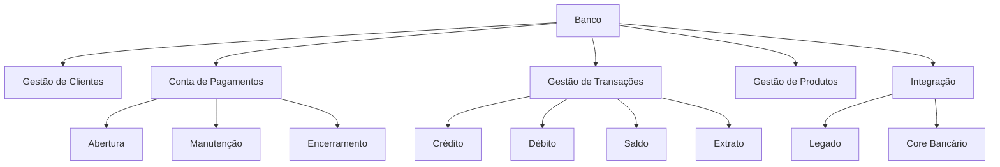
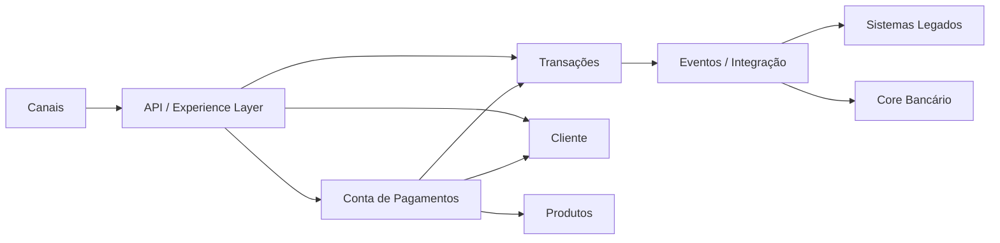
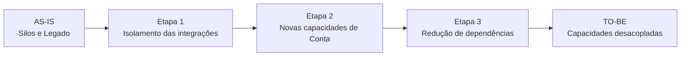

# AIP-001 — Architecture Improvement Proposal: Conta de Pagamentos

## Status

Proposta — em avaliação

## Tipo

Architecture Improvement Proposal (AIP)

## Título

Introdução de uma capacidade de Conta de Pagamentos desacoplada do legado

## Resumo

Esta proposta descreve uma evolução arquitetural para habilitar o produto **Conta de Pagamentos**, considerando o cenário atual do banco, no qual as capacidades foram construídas em silos e possuem baixo reaproveitamento.

A proposta preserva o estilo arquitetural baseado em Microservices e busca criar uma separação clara entre capacidades de negócio, permitindo evolução incremental e redução da dependência direta dos sistemas legados.

Esta proposta não representa uma decisão final sobre a adoção do produto.

---

## Motivação

O banco deseja ampliar seu portfólio e aumentar o engajamento dos clientes. Entre os produtos avaliados nos testes realizados, a Conta de Pagamentos apresentou resultados positivos.

O cenário atual apresenta:

- capacidades construídas em silos;
- baixo reaproveitamento entre produtos;
- legado impactando a cadeia de valor;
- necessidade de acelerar o lançamento de novos produtos;
- questionamento sobre a aquisição de uma plataforma de Core Bancário.

A arquitetura atual utiliza Microservices e o case estabelece que esse estilo deve ser preservado.

---

## Problema arquitetural

A introdução de uma Conta de Pagamentos diretamente sobre as estruturas existentes pode aumentar a dependência do novo produto em relação aos sistemas legados.

O principal problema a ser endereçado é:

> Como habilitar uma Conta de Pagamentos reutilizando capacidades existentes e, ao mesmo tempo, reduzindo o acoplamento do novo produto aos silos legados?

---

## Objetivos

A proposta busca:

1. Habilitar a capacidade de Conta de Pagamentos.
2. Separar o domínio de Conta de Pagamentos dos produtos de crédito existentes.
3. Promover reutilização de capacidades.
4. Reduzir dependências diretas entre o novo produto e o legado.
5. Preservar Microservices.
6. Permitir evolução incremental para uma arquitetura TO-BE.
7. Facilitar futuros lançamentos de produtos que dependam de capacidades financeiras comuns.

---

## Não objetivos

Esta proposta não define:

- aquisição ou não de uma plataforma de Core Bancário;
- fornecedor de Core Bancário;
- tecnologia específica para implementação dos serviços;
- decomposição definitiva de todos os Microservices;
- migração completa de todos os sistemas legados;
- decisão entre Conta de Pagamentos e Cashback.

Esses pontos dependem das análises posteriores.

---

## Modelo de domínio proposto

O cenário introduz a **Conta de Pagamentos** como um contexto de negócio próprio.



---

## Proposta arquitetural

A arquitetura deverá organizar a solução em torno das capacidades de negócio, evitando que a Conta de Pagamentos seja implementada como uma extensão direta de um produto legado.

Uma visão conceitual seria:



O desenho acima é conceitual. A decomposição definitiva em serviços deverá ocorrer depois do detalhamento das capacidades e funcionalidades.

---

## Building Blocks candidatos

| Building Block | Responsabilidade |
|---|---|
| Account Management | Gestão do ciclo de vida da Conta de Pagamentos |
| Transaction Management | Gestão das movimentações financeiras |
| Customer Management | Gestão e consulta de informações do cliente |
| Product Management | Gestão das características do produto |
| Integration Layer | Integração com sistemas internos e externos |
| Legacy Adapter | Isolamento das particularidades dos sistemas legados |
| Core Banking Adapter | Integração com eventual plataforma de Core Bancário |
| API Layer | Exposição das funcionalidades aos canais consumidores |

---

## Princípios da proposta

### Separação de responsabilidades

A Conta de Pagamentos deve possuir responsabilidades de negócio claramente delimitadas.

### Reutilização

Capacidades existentes devem ser reutilizadas quando estiverem adequadas ao novo produto.

### Anti-Corruption Layer

Quando o legado utilizar modelos incompatíveis com o novo domínio, deve ser considerado um mecanismo de isolamento entre os modelos.

### Evolução incremental

A solução deve permitir que partes do legado sejam substituídas ou desacopladas gradualmente.

### Contratos explícitos

Integrações entre capacidades devem utilizar contratos bem definidos, evitando dependências internas entre implementações.

---

## Impactos esperados

### Positivos

- Maior isolamento do novo produto.
- Possibilidade de reutilização de capacidades.
- Redução gradual do acoplamento ao legado.
- Evolução independente das capacidades.
- Maior clareza dos limites de negócio.
- Base arquitetural para futuros produtos financeiros.

### Trade-offs

- Aumento inicial da complexidade de integração.
- Necessidade de novos contratos entre serviços.
- Necessidade de governança sobre APIs e eventos.
- Possível coexistência entre arquitetura nova e sistemas legados.
- Necessidade de arquiteturas intermediárias durante a migração.

---

## Estratégia de migração

A migração deverá ser incremental.



A sequência definitiva deverá ser definida após o mapeamento das dependências do legado.

---

## Relação com Core Bancário

A aquisição de uma plataforma de Core Bancário deve ser tratada como uma alternativa arquitetural a ser avaliada, e não como premissa desta proposta.

A análise deverá verificar:

- quais capacidades a plataforma fornece;
- quais capacidades continuam sob responsabilidade do banco;
- quais integrações seriam necessárias;
- impacto sobre os sistemas existentes;
- impacto sobre o modelo de domínio;
- impacto sobre a estratégia de migração.

---

## Compatibilidade com a arquitetura atual

A proposta é compatível conceitualmente com o estilo Microservices estabelecido no case.

A mudança proposta está principalmente na organização das responsabilidades de negócio e na redução do acoplamento entre o novo produto e o legado.

---

## Questões em aberto

1. Quais operações devem ser suportadas pela Conta de Pagamentos?
2. Quais capacidades existentes podem ser reutilizadas?
3. Qual é o limite de responsabilidade da Conta de Pagamentos?
4. Quais capacidades devem permanecer no legado?
5. Qual é o papel de um eventual Core Bancário?
6. Quais requisitos regulatórios e de segurança devem ser considerados?
7. Quais APIs e eventos serão necessários?
8. Qual estratégia de migração minimiza impacto na cadeia de valor?

---

## Relação com outros artefatos

```text
AIP-001
  │
  ├── Requisitos
  ├── Linguagem Ubíqua
  ├── Subdomínios
  ├── Capacidades
  ├── Value Streams
  ├── Building Blocks
  └── Arquitetura TO-BE
```

## Decisão

Não definida neste AIP.

Este documento registra uma proposta arquitetural para avaliação do cenário de Conta de Pagamentos.
