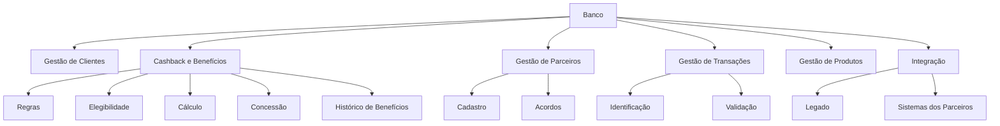
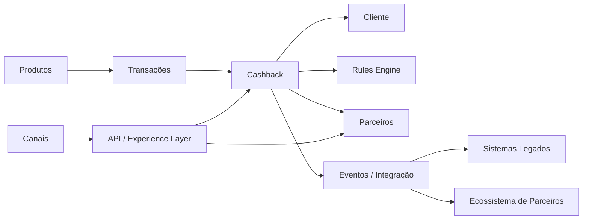
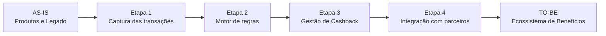

# AIP-002 — Architecture Improvement Proposal: Cashback com Parcerias

## Status

Proposta — em avaliação

## Tipo

Architecture Improvement Proposal (AIP)

## Título

Introdução de uma capacidade de Cashback e Benefícios integrada a um ecossistema de parceiros

## Resumo

Esta proposta descreve uma evolução arquitetural para habilitar um programa de **Cashback com parcerias**, considerando o cenário atual do banco, no qual as capacidades foram construídas em silos e apresentam baixo reaproveitamento.

A proposta preserva o estilo arquitetural baseado em Microservices e cria uma separação entre a gestão do benefício, as regras de negócio, os parceiros e as transações que originam o benefício.

Esta proposta não representa uma decisão final sobre a adoção do produto.

---

## Motivação

O banco busca ampliar seu portfólio e aumentar o engajamento dos clientes. O programa de Cashback com parcerias apresentou resultados positivos nos testes realizados.

O cenário atual apresenta:

- capacidades construídas em silos;
- baixo reaproveitamento;
- legado impactando a cadeia de valor;
- necessidade de acelerar lançamentos;
- necessidade de avaliar o papel de uma eventual plataforma de Core Bancário.

---

## Problema arquitetural

A implementação de Cashback diretamente dentro dos produtos existentes pode criar forte acoplamento entre regras de benefício, produtos, transações e integrações com parceiros.

O principal problema a ser endereçado é:

> Como habilitar um programa de Cashback com parceiros mantendo as regras de benefício desacopladas dos produtos existentes e permitindo evolução independente do ecossistema?

---

## Objetivos

A proposta busca:

1. Habilitar o programa de Cashback.
2. Criar uma capacidade específica para gestão de benefícios.
3. Separar regras de Cashback dos produtos que originam as transações.
4. Permitir integração com parceiros.
5. Reutilizar capacidades existentes.
6. Preservar Microservices.
7. Permitir evolução independente das regras de negócio.
8. Reduzir dependências diretas com o legado.

---

## Não objetivos

Esta proposta não define:

- decisão entre Cashback e Conta de Pagamentos;
- aquisição de Core Bancário;
- fornecedor de plataforma de Cashback;
- modelo comercial definitivo com parceiros;
- decomposição definitiva de todos os Microservices;
- regras comerciais específicas que não estejam descritas no case.

---

## Modelo de domínio proposto

O programa de Cashback é tratado como um contexto de negócio próprio.



---

## Proposta arquitetural

A capacidade de Cashback deverá ser organizada de forma independente dos produtos que originam as transações.



O desenho é conceitual e deverá ser refinado a partir das capacidades e funcionalidades identificadas.

---

## Building Blocks candidatos

| Building Block | Responsabilidade |
|---|---|
| Cashback Management | Gestão do ciclo de vida do benefício |
| Rules Management | Definição e aplicação das regras |
| Eligibility Management | Determinação da elegibilidade |
| Cashback Calculation | Cálculo do benefício |
| Benefit Ledger | Registro dos benefícios concedidos |
| Partner Management | Gestão dos parceiros |
| Partner Integration | Integração com sistemas externos |
| Transaction Integration | Recebimento e processamento dos eventos/transações relevantes |
| Customer Management | Consulta das informações necessárias do cliente |
| Integration Layer | Integração com sistemas internos e externos |

---

## Princípios da proposta

### Separação das regras de negócio

As regras de Cashback devem permanecer separadas dos produtos que geram as transações.

### Configurabilidade

As regras devem ser estruturadas de forma que sua evolução não dependa necessariamente de alterações nos produtos consumidores.

### Integração orientada a eventos

Eventos de transações podem ser considerados como mecanismo de integração, especialmente quando o benefício depende de transações realizadas em outros produtos.

### Isolamento dos parceiros

As particularidades de cada parceiro não devem contaminar o domínio central de Cashback.

### Reutilização

Capacidades existentes de cliente, produto e transação devem ser reutilizadas quando adequadas.

---

## Impactos esperados

### Positivos

- Separação do domínio de benefícios.
- Maior independência das regras de Cashback.
- Facilidade de inclusão de novos parceiros.
- Possibilidade de reutilização por diferentes produtos.
- Redução de acoplamento entre Cashback e produtos existentes.
- Possibilidade de evolução independente do programa.

### Trade-offs

- Introdução de novos componentes de integração.
- Necessidade de governança das regras.
- Complexidade adicional para processamento de eventos.
- Necessidade de garantir consistência entre transação e benefício.
- Necessidade de mecanismos de reconciliação.
- Dependência de integrações com parceiros externos.

---

## Estratégia de migração

Uma possível evolução incremental seria:



A ordem definitiva deverá ser validada após o levantamento das dependências e capacidades existentes.

---

## Relação com Core Bancário

A eventual aquisição de uma plataforma de Core Bancário deverá ser analisada em relação às capacidades efetivamente necessárias.

O Core Bancário pode ser considerado como parte da infraestrutura de capacidades bancárias, mas não deve ser assumido automaticamente como responsável pela gestão das regras ou do programa de Cashback.

A análise deverá verificar:

- capacidades fornecidas;
- capacidades mantidas pelo banco;
- integrações;
- modelo de dados;
- eventos disponíveis;
- impacto no legado;
- impacto na estratégia de migração.

---

## Compatibilidade com a arquitetura atual

A proposta preserva o estilo arquitetural baseado em Microservices definido no case.

A principal evolução está na separação do contexto de Cashback e na definição explícita das fronteiras entre:

```text
Produto
   ↓
Transação
   ↓
Elegibilidade
   ↓
Regra
   ↓
Cálculo
   ↓
Benefício
   ↓
Parceiro
```

---

## Questões em aberto

1. Qual evento caracteriza uma transação elegível?
2. Quais são as regras de elegibilidade?
3. Como as regras serão configuradas?
4. Como será realizada a liquidação do Cashback?
5. Quem será responsável pelo pagamento do benefício?
6. Como serão tratados cancelamentos e estornos?
7. Como será realizada a reconciliação com os parceiros?
8. Quais informações serão necessárias do cliente?
9. Quais APIs e eventos serão necessários?
10. Quais capacidades existentes podem ser reutilizadas?
11. Qual é o papel de um eventual Core Bancário?
12. Quais requisitos regulatórios e de segurança devem ser considerados?

---

## Relação com outros artefatos

```text
AIP-002
  │
  ├── Requisitos
  ├── Linguagem Ubíqua
  ├── Subdomínios
  ├── Capacidades
  ├── Value Streams
  ├── Building Blocks
  └── Arquitetura TO-BE
```

## Decisão

Não definida neste AIP.

Este documento registra uma proposta arquitetural para avaliação do cenário de Cashback com Parcerias.
