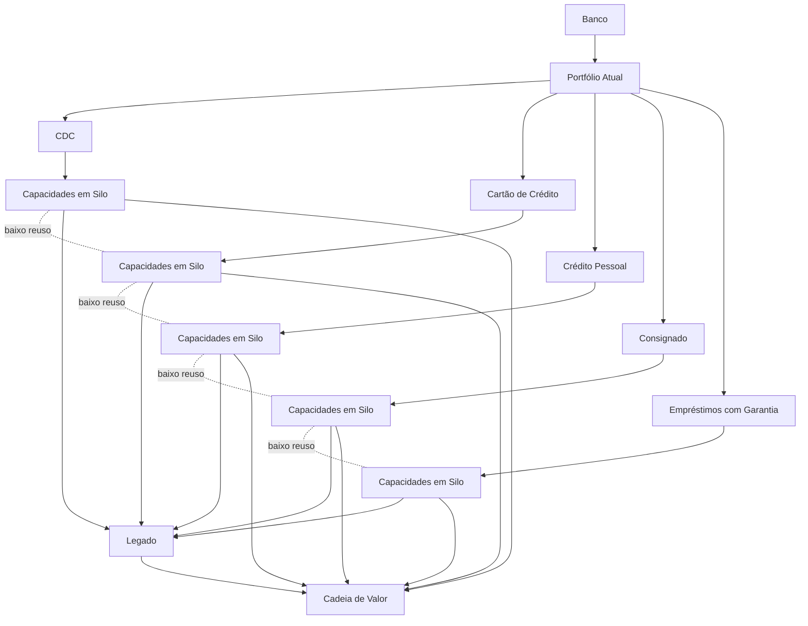
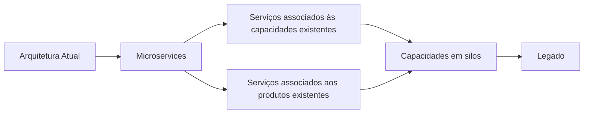
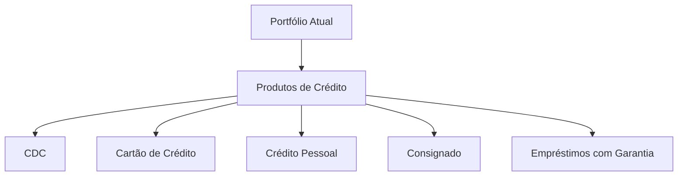
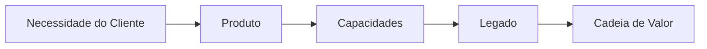
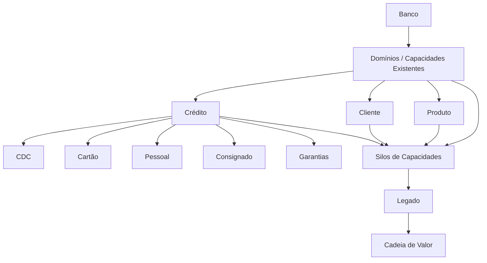
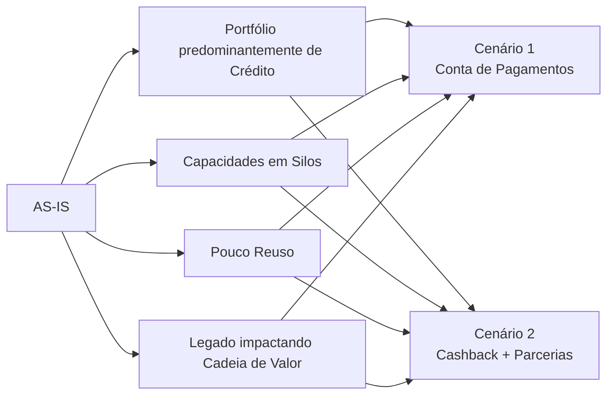
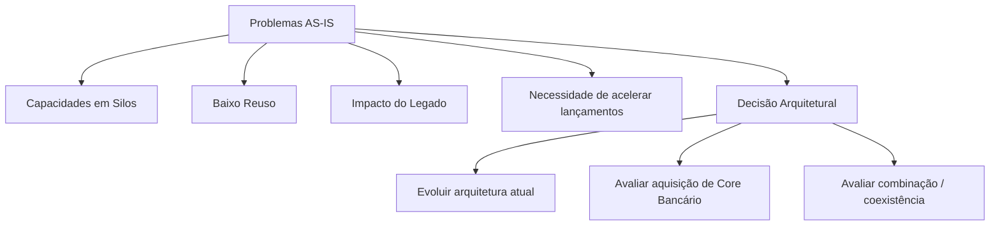

# Arquitetura Atual (AS-IS) — Visão Arquitetural do Case

## 1. Objetivo

Este documento representa a **Arquitetura Atual (AS-IS) conhecida a partir das informações fornecidas pelo case**.

O objetivo não é inventar uma arquitetura física ou tecnológica detalhada, mas consolidar o que é possível afirmar sobre o estado atual e transformar as evidências do case em uma visão arquitetural coerente.

Quando uma informação não é explicitamente fornecida, ela é identificada como **hipótese arquitetural**.

---

## 2. Evidências do Case

O case informa os seguintes elementos sobre o estado atual:

1. O banco possui um portfólio predominantemente baseado em produtos de empréstimos.
2. Entre os produtos existentes estão:
   - Crédito Direto ao Consumidor;
   - Cartão de Crédito;
   - Crédito Pessoal;
   - Consignado;
   - Empréstimos com garantia.
3. As capacidades foram construídas em **silos**.
4. Existe **pouco reaproveitamento** entre essas capacidades.
5. O legado está em silos e impacta a cadeia de valor da companhia.
6. O estilo arquitetural atual é **Microservices**.
7. A organização deseja ampliar o portfólio e aumentar o engajamento.
8. Existe uma expectativa de que o novo produto também contribua para melhorar a arquitetura atual e acelerar lançamentos futuros.
9. O CTO levantou a possibilidade de aquisição de uma plataforma de Core Bancário.
10. O CIO solicitou que Enterprise Architecture fosse consultada antes dessa decisão.

Essas evidências são a base do AS-IS.

---

## 3. Limite de Conhecimento

O case **não fornece** detalhes suficientes para afirmar:

- quais sistemas implementam cada capacidade;
- quantidade de microservices;
- nomes dos microservices;
- bancos de dados utilizados;
- APIs existentes;
- eventos existentes;
- infraestrutura;
- provedores cloud;
- mecanismos de mensageria;
- regras de negócio existentes;
- níveis de disponibilidade;
- SLAs;
- ownership das capacidades;
- contratos de integração;
- arquitetura detalhada do legado;
- qual produto possui maior ou menor aderência arquitetural.

Portanto, esses elementos não serão apresentados como fatos.

---

# 4. Visão AS-IS

A visão atual pode ser representada conceitualmente da seguinte forma:



O ponto central do AS-IS não é que cada produto necessariamente possua um sistema isolado. O que o case afirma é que **as capacidades foram construídas em silos e possuem pouco reaproveitamento**.

---

# 5. Estilo Arquitetural Atual

O case declara que o estilo arquitetural vigente é:

```text
Microservices
```

Portanto, a arquitetura atual deve ser considerada uma arquitetura baseada em Microservices.

Entretanto, o case não informa como esses Microservices estão distribuídos ou quais padrões internos foram utilizados.

Assim:



A relação entre Microservices, capacidades e legado acima é uma **representação lógica do problema**, e não um inventário dos serviços existentes.

---

# 6. Portfólio e Organização Atual

O portfólio atual possui forte concentração em produtos de crédito.



Isso demonstra uma característica importante do contexto atual:

```text
Portfólio predominantemente orientado a crédito
                    ↓
Capacidades construídas em silos
                    ↓
Baixo reaproveitamento
                    ↓
Impacto na evolução da cadeia de valor
```

---

# 7. Situação Atual das Capacidades

Com base no case, podemos afirmar:

| Aspecto | Situação AS-IS conhecida |
|---|---|
| Capacidades de negócio | Existem |
| Organização das capacidades | Construídas em silos |
| Reutilização | Pouco reaproveitamento |
| Legado | Presente e impactando a cadeia de valor |
| Estilo arquitetural | Microservices |
| Portfólio | Predominantemente crédito |
| Evolução de produtos | Existe necessidade de acelerar lançamentos |
| Conta de Pagamentos | Ainda não é apresentada como produto atual |
| Cashback | Ainda não é apresentado como produto atual |
| Core Bancário | Não informado como existente; aparece como hipótese de aquisição |
| Arquitetura detalhada | Não fornecida |

---

# 8. Problemas Arquiteturais do AS-IS

A partir das evidências do case, os problemas podem ser consolidados em quatro grupos.

## 8.1 Silificação

As capacidades foram construídas em silos.

```text
Capacidade A ── Produto A

Capacidade B ── Produto B

Capacidade C ── Produto C
```

O problema arquitetural é a dificuldade de tratar capacidades como componentes reutilizáveis do negócio.

---

## 8.2 Baixo Reuso

O case afirma que existe pouco reaproveitamento.

Isso gera uma hipótese de impacto:

```text
Nova necessidade
      ↓
Necessidade de construir novamente
      ↓
Maior esforço
      ↓
Maior dependência entre produtos
      ↓
Menor velocidade de lançamento
```

A relação causal detalhada acima é uma **interpretação arquitetural** do problema descrito no case.

---

## 8.3 Impacto do Legado na Cadeia de Valor

O case afirma explicitamente que o legado impacta a cadeia de valor.

A representação conceitual é:



O case não especifica exatamente quais etapas da cadeia de valor são afetadas.

---

## 8.4 Dificuldade de Evolução

A expectativa do C-level é que o novo produto contribua para melhorar a arquitetura e acelerar futuros lançamentos.

Isso indica que o estado atual possui uma necessidade de evolução arquitetural.

Não significa, entretanto, que a arquitetura atual seja considerada inadequada em sua totalidade.

O próprio case determina que o estilo Microservices seja preservado e que aquilo que já estiver aderente à referência arquitetural vigente seja potencializado.

---

# 9. AS-IS — Capacidades Conhecidas e Hipóteses

É importante separar o que foi explicitamente informado do que foi derivado da análise.

| Elemento | Origem | Status |
|---|---|---|
| Gestão relacionada a crédito | Produtos existentes no case | Evidência |
| Capacidades em silos | Case | Evidência |
| Baixo reaproveitamento | Case | Evidência |
| Legado impactando cadeia de valor | Case | Evidência |
| Microservices | Case | Evidência |
| Gestão de Contas | Necessidade derivada do cenário de Conta | Hipótese |
| Gestão de Benefícios | Necessidade derivada do cenário de Cashback | Hipótese |
| Gestão de Parceiros | Necessidade derivada do cenário de Cashback com parcerias | Hipótese |
| Gestão de Transações | Derivada dos cenários | Hipótese |
| Gestão de Clientes | Capacidade transversal provável | Hipótese |
| Gestão de Produtos | Capacidade transversal provável | Hipótese |
| Gestão de Integrações | Derivada do problema de interoperabilidade | Hipótese |

Essa distinção deve ser mantida nos próximos documentos.

---

# 10. AS-IS Conceitual de Domínios

A partir das informações disponíveis, podemos estabelecer uma visão conceitual:



Os elementos `Cliente` e `Produto` aparecem aqui como **hipóteses de capacidades necessárias ao contexto**, não como inventário confirmado pelo case.

---

# 11. Relação com os Novos Cenários

A partir do AS-IS, os dois produtos avaliados representam necessidades que deverão ser incorporadas à arquitetura.



A finalidade da análise arquitetural é verificar como cada cenário pode ser habilitado **sem simplesmente reproduzir os problemas existentes**.

---

# 12. Questão do Core Bancário

O Core Bancário aparece no case como uma provocação do CTO:

> adquirir uma plataforma de Core Bancário poderia resolver os problemas atuais?

No AS-IS, portanto, ele deve ser tratado como:

```text
Alternativa arquitetural em avaliação
```

e não como parte da arquitetura atual.



Nenhuma dessas alternativas deve ser considerada decisão neste documento.

---

# 13. Princípio para a Evolução do AS-IS

O próprio case estabelece uma diretriz importante:

```text
Arquitetura Atual
      ↓
Identificar aderência à referência arquitetural
      ↓
        ┌───────────────┐
        │               │
    Aderente       Não aderente
        │               │
   Potencializar     TO-BE
                        ↓
                   Migração
```

Isso significa que o objetivo não é substituir indiscriminadamente a arquitetura existente.

A abordagem deve preservar o que estiver aderente e transformar aquilo que não estiver.

---

# 14. Rastreabilidade

| ID | Evidência / Problema | Impacto arquitetural |
|---|---|---|
| ASIS-001 | Portfólio predominantemente de crédito | Necessidade de ampliar capacidades/produtos |
| ASIS-002 | Capacidades construídas em silos | Baixa composição e reutilização |
| ASIS-003 | Pouco reaproveitamento | Necessidade de identificar capacidades reutilizáveis |
| ASIS-004 | Legado impacta cadeia de valor | Necessidade de reduzir acoplamento/impacto |
| ASIS-005 | Arquitetura baseada em Microservices | Estilo deve ser preservado |
| ASIS-006 | Necessidade de acelerar lançamentos | Arquitetura deve favorecer evolução |
| ASIS-007 | Possibilidade de Core Bancário | Necessidade de avaliação arquitetural antes da aquisição |

---

# 15. O que este AS-IS permite afirmar

Podemos afirmar com segurança que o cenário atual possui:

```text
Portfólio fortemente orientado a crédito
                +
Capacidades em silos
                +
Baixo reaproveitamento
                +
Legado impactando a cadeia de valor
                +
Arquitetura baseada em Microservices
                ↓
Necessidade de evolução arquitetural
```

Não podemos afirmar, a partir do case, que:

```text
Existe um determinado Core Banking
Existe determinado banco de dados
Existe determinada API
Existe determinado Microservice
Existe determinada plataforma cloud
Existe determinada arquitetura de eventos
Existe determinada capacidade com determinada maturidade
```

Esses elementos deverão ser tratados como hipóteses caso sejam necessários nos artefatos seguintes.

---

# 16. Próximo Artefato

Este AS-IS pode agora servir como entrada para a próxima camada:

```text
AS-IS
  ↓
Problemas de Negócio
  ↓
Capability Map
  ↓
Gap / Capability Assessment
  ↓
Value Streams
  ↓
Arquitetura de Visão
  ↓
TO-BE
  ↓
Arquiteturas Intermediárias
  ↓
Plano de Migração
```

A principal vantagem desta abordagem é manter a rastreabilidade:

```text
Evidência do Case
      ↓
Problema
      ↓
Capacidade impactada
      ↓
Necessidade arquitetural
      ↓
Decisão
      ↓
TO-BE
      ↓
Migração
```
