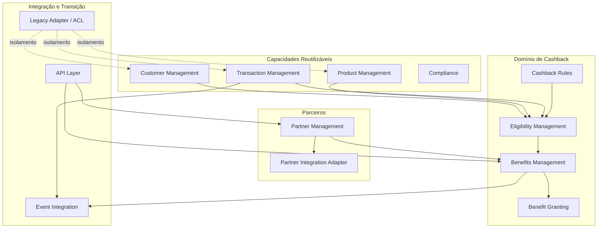
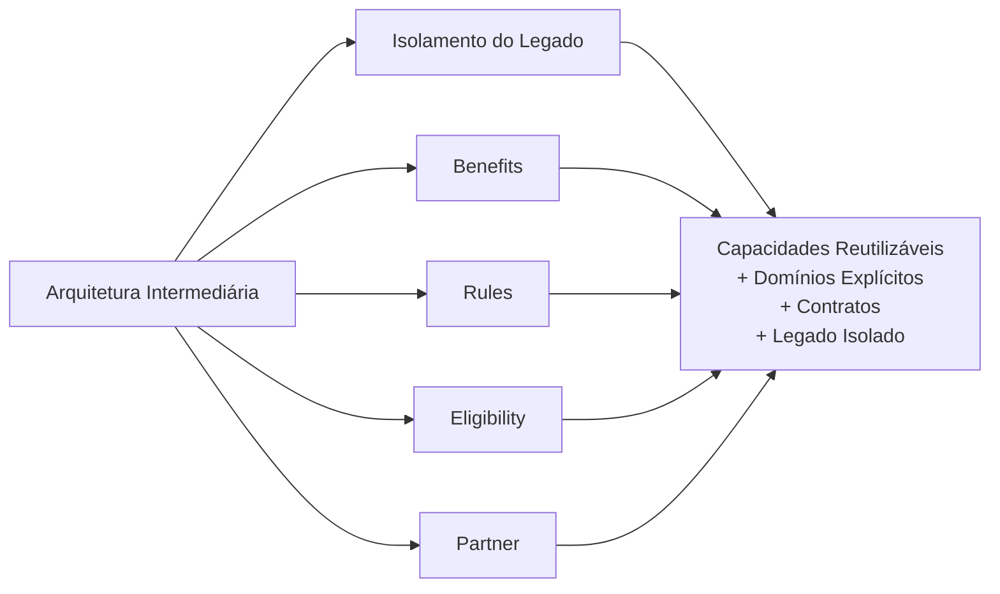

# Building Blocks — Cashback com Parcerias

## 1. Objetivo

Este documento identifica os Building Blocks candidatos para a evolução arquitetural do cenário de Cashback com Parcerias.

Os Building Blocks são derivados dos estrangulamentos identificados anteriormente:

- capacidades em silos;
- baixo reuso;
- dependência do legado;
- integrações pouco explícitas;
- regras de negócio potencialmente acopladas;
- integração com parceiros.

O objetivo não é definir ainda a decomposição final em Microservices. Os Building Blocks representam unidades arquiteturais e de negócio que poderão posteriormente ser realizados por um ou mais componentes de aplicação.

---

## 2. Relação com a decisão arquitetural

A ADR-002 definiu Cashback com Parcerias como primeiro veículo de transformação arquitetural.

A arquitetura intermediária estabeleceu que a evolução deve:

1. reutilizar capacidades existentes;
2. introduzir novas capacidades de forma incremental;
3. isolar o legado;
4. estabelecer contratos explícitos;
5. evitar a criação de um novo silo;
6. evoluir progressivamente para o TO-BE.

Os Building Blocks são o mecanismo para materializar essas decisões.

---

# 3. Classificação dos Building Blocks

Os blocos são organizados em quatro grupos:

| Grupo | Objetivo |
|---|---|
| Capacidades reutilizáveis | Aproveitar capacidades existentes e evitar duplicação |
| Domínio de Cashback | Implementar as novas capacidades específicas do cenário |
| Ecossistema de parceiros | Encapsular relacionamento e integração externa |
| Integração e transição | Permitir interoperabilidade e coexistência com o legado |

---

# 4. Building Blocks de Capacidades Reutilizáveis

## 4.1 Customer Management

### Responsabilidade

Disponibilizar informações e operações relacionadas ao cliente necessárias para os processos do banco e para a avaliação de benefícios.

### Responsabilidades candidatas

- consultar cliente;
- identificar cliente;
- disponibilizar dados necessários ao processo;
- consultar situação cadastral, quando aplicável.

### Consumidores

- Eligibility;
- Benefits;
- demais produtos que necessitem da capacidade.

### Estrangulamento tratado

**Baixo reuso.**

A capacidade de cliente deve ser consumida pelo Cashback em vez de ser recriada dentro do novo produto.

### Intermediária

Pode inicialmente permanecer como capacidade existente, sendo consumida por meio de contrato definido para o novo cenário.

### TO-BE

Consolidar como Building Block reutilizável.

---

## 4.2 Product Management

### Responsabilidade

Disponibilizar informações sobre produtos necessárias para identificar ofertas, regras e elegibilidade.

### Responsabilidades candidatas

- consultar produto;
- identificar produto;
- disponibilizar características relevantes;
- informar relacionamento do cliente com produto, quando aplicável.

### Consumidores

- Eligibility;
- Benefits;
- novos produtos futuros.

### Estrangulamento tratado

**Baixo reuso e capacidades em silos.**

### Intermediária

Reutilizar a capacidade existente sem duplicar informações de produto no Cashback.

### TO-BE

Disponibilizar Product Management como capacidade compartilhada.

---

## 4.3 Transaction Management

### Responsabilidade

Disponibilizar informações sobre transações utilizadas para determinar eventos elegíveis ao Cashback.

### Responsabilidades candidatas

- receber ou disponibilizar eventos de transação;
- identificar transação;
- validar informações necessárias;
- disponibilizar dados para avaliação do benefício.

### Consumidores

- Eligibility;
- Benefits;
- outros produtos que necessitem de eventos transacionais.

### Estrangulamento tratado

**Baixo reuso e integração pouco explícita.**

### Intermediária

Cashback consome a capacidade transacional existente através de contrato explícito.

### TO-BE

Transaction Management torna-se um Building Block reutilizável e desacoplado do domínio específico de Cashback.

---

## 4.4 Compliance

### Responsabilidade

Disponibilizar controles e validações necessários aos processos sujeitos a regras de conformidade.

### Observação

O caso não detalha quais controles de Compliance serão necessários para Cashback.

Portanto, neste estágio, o bloco é identificado como capacidade de integração/reuso e não como uma especificação funcional completa.

### Estrangulamento tratado

**Reimplementação e acoplamento de capacidades transversais.**

---

# 5. Building Blocks do Domínio de Cashback

## 5.1 Benefits Management

### Responsabilidade

Gerenciar o ciclo de vida dos benefícios de Cashback.

### Responsabilidades candidatas

- definir benefício;
- configurar benefício;
- identificar benefício aplicável;
- calcular benefício;
- registrar concessão;
- consultar histórico;
- disponibilizar benefício ao cliente.

### Entradas

- cliente;
- produto;
- transação;
- regra;
- elegibilidade;
- programa;
- parceiro.

### Saídas

- benefício calculado;
- concessão de Cashback;
- histórico do benefício;
- evento de benefício.

### Estrangulamento tratado

**Capacidades em silos e baixo reuso.**

### Intermediária

Introduzir como novo componente específico do domínio de Cashback.

### TO-BE

Consolidar como capacidade de Benefits reutilizável por outros produtos.

---

## 5.2 Cashback Rules

### Responsabilidade

Gerenciar as regras utilizadas para determinar as condições dos benefícios.

### Responsabilidades candidatas

- criar regra;
- alterar regra;
- ativar regra;
- desativar regra;
- versionar regra;
- avaliar regra.

### Princípio

A regra não deve ficar embutida diretamente em cada integração ou produto.

### Estrangulamento tratado

**Regras de negócio acopladas ao produto.**

### Intermediária

Extrair inicialmente apenas as regras necessárias ao cenário de Cashback.

### TO-BE

Disponibilizar regras como capacidade independente e evolutiva.

---

## 5.3 Eligibility Management

### Responsabilidade

Determinar se cliente, produto ou transação atende às condições necessárias para receber determinado benefício.

### Responsabilidades candidatas

- identificar programa aplicável;
- identificar cliente;
- avaliar condições;
- consultar regras;
- determinar elegibilidade;
- registrar decisão.

### Entradas

- Customer;
- Product;
- Transaction;
- Rules;
- Program;
- Partner.

### Saída

Uma decisão de elegibilidade utilizada pelo processo de concessão.

### Estrangulamento tratado

**Acoplamento entre regras, produto e processamento da transação.**

### Intermediária

Introduzir a avaliação de elegibilidade como capacidade explícita no fluxo.

### TO-BE

Consolidar Eligibility como Building Block reutilizável.

---

## 5.4 Benefit Granting

### Responsabilidade

Representar a concessão efetiva do benefício após a determinação de elegibilidade e cálculo.

### Responsabilidades candidatas

- registrar concessão;
- associar concessão ao cliente;
- registrar valor;
- registrar referência à transação;
- disponibilizar histórico.

### Observação

Benefit Granting pode inicialmente fazer parte de Benefits Management.

A separação como Building Block independente deverá ser validada posteriormente pelo desenho de domínio e pelos requisitos de volume, autonomia e evolução.

### Estrangulamento tratado

**Mistura de responsabilidades dentro do produto.**

---

# 6. Building Blocks do Ecossistema de Parceiros

## 6.1 Partner Management

### Responsabilidade

Gerenciar os parceiros participantes dos programas de Cashback.

### Responsabilidades candidatas

- cadastrar parceiro;
- manter parceiro;
- gerenciar acordo;
- configurar participação;
- controlar status;
- disponibilizar informações do parceiro.

### Estrangulamento tratado

**Integrações específicas e heterogeneidade externa.**

### Intermediária

Introduzir uma abstração de parceiro antes de permitir que o domínio de Cashback conheça detalhes específicos de cada parceiro.

### TO-BE

Partner Management torna-se uma capacidade explícita do ecossistema.

---

## 6.2 Partner Integration Adapter

### Responsabilidade

Isolar os detalhes técnicos e contratuais específicos de cada parceiro.

### Responsabilidades candidatas

- transformação de mensagens;
- comunicação com parceiro;
- tratamento de contrato externo;
- tradução de modelos;
- tratamento de diferenças específicas de integração.

### Princípio

O domínio de Cashback não deve depender diretamente do modelo técnico de um parceiro específico.

### Estrangulamento tratado

**Complexidade e acoplamento com integrações externas.**

### Intermediária

Pode existir inicialmente para o primeiro parceiro.

### TO-BE

Evoluir para um padrão de integração que permita adicionar parceiros sem alterar o núcleo do domínio.

---

# 7. Building Blocks de Integração e Transição

## 7.1 API Layer

### Responsabilidade

Disponibilizar contratos síncronos para consumidores autorizados.

### Uso candidato

- consulta de benefícios;
- consulta de elegibilidade;
- operações de manutenção;
- consultas de parceiro;
- integração com canais ou produtos.

### Estrangulamento tratado

**Integrações pouco explícitas.**

### Intermediária

Criar apenas os contratos necessários ao cenário.

### TO-BE

Consolidar APIs estáveis e orientadas às capacidades.

---

## 7.2 Event Integration

### Responsabilidade

Permitir comunicação orientada a eventos quando a natureza do processo justificar desacoplamento temporal.

### Eventos candidatos

- TransactionOccurred;
- CashbackEligibilityEvaluated;
- CashbackCalculated;
- CashbackGranted;
- PartnerUpdated.

Esses nomes são candidatos conceituais e deverão ser validados no DDD tático e no desenho de contratos.

### Estrangulamento tratado

**Acoplamento entre capacidades.**

---

## 7.3 Legacy Adapter / ACL

### Responsabilidade

Isolar o novo domínio dos modelos e interfaces do legado.

### Responsabilidades candidatas

- tradução de modelos;
- adaptação de contratos;
- encapsulamento de chamadas legadas;
- proteção do modelo de domínio;
- controle da dependência durante a migração.

### Estrangulamento tratado

**Dependência do legado.**

### Intermediária

É um componente central da estratégia de coexistência.

### TO-BE

Pode ser reduzido ou removido conforme as responsabilidades sejam migradas ou substituídas.

---

# 8. Mapa Consolidado



---

# 9. Priorização para a Arquitetura Intermediária

A ordem abaixo não representa ranking de importância. Representa uma possível sequência de introdução baseada nos estrangulamentos identificados.

| Etapa | Building Blocks | Objetivo |
|---|---|---|
| 1 | API Layer / Legacy Adapter | Criar contratos e isolamento |
| 2 | Transaction Management | Disponibilizar evento/dado de transação |
| 3 | Benefits Management | Introduzir o novo domínio |
| 4 | Cashback Rules | Separar regras |
| 5 | Eligibility Management | Tornar decisão explícita |
| 6 | Partner Management | Estruturar parceiros |
| 7 | Partner Adapter | Isolar integrações externas |
| 8 | Event Integration | Evoluir desacoplamento |
| 9 | Benefit Granting | Avaliar eventual separação de responsabilidade |

A sequência definitiva deve ser validada no plano de migração.

---

# 10. Building Blocks e TO-BE



---

# 11. Building Block x Estrangulamento

| Building Block | Silo | Baixo Reuso | Legado | Integração | Regras Acopladas | Parceiros |
|---|:---:|:---:|:---:|:---:|:---:|:---:|
| Customer Management | X | X | X | X |  |  |
| Product Management | X | X | X | X |  |  |
| Transaction Management | X | X | X | X |  |  |
| Benefits Management | X | X |  | X | X |  |
| Cashback Rules |  | X |  | X | X |  |
| Eligibility Management |  | X |  | X | X |  |
| Benefit Granting | X | X |  | X | X |  |
| Partner Management | X | X |  | X |  | X |
| Partner Adapter |  |  |  | X |  | X |
| API Layer |  | X | X | X |  |  |
| Event Integration |  | X | X | X |  |  |
| Legacy Adapter / ACL |  |  | X | X |  |  |

A matriz é uma ferramenta de rastreabilidade arquitetural, não uma avaliação quantitativa.

---

# 12. Building Block ≠ Microservice

Neste estágio:

```text
Building Block
      ↓
Responsabilidade arquitetural
      ↓
Limite de negócio
      ↓
DDD Tático
      ↓
Bounded Context
      ↓
Microservice(s)
```

Não devemos transformar automaticamente cada Building Block em um Microservice.

Por exemplo:

```text
Benefits Management
├── Benefício
├── Programa
├── Concessão
└── Histórico
```

pode resultar em um ou mais componentes dependendo das fronteiras de domínio, autonomia, dados, consistência e evolução.

Da mesma forma:

```text
Cashback Rules
Eligibility Management
```

podem possuir limites distintos ou inicialmente coexistir, caso o DDD tático demonstre forte coesão entre suas responsabilidades.

---

# 13. Relação com Bounded Contexts

Os Building Blocks fornecem insumo para a próxima análise:

| Building Block | Contexto candidato |
|---|---|
| Customer Management | Customer |
| Product Management | Product |
| Transaction Management | Transaction |
| Benefits Management | Benefits |
| Cashback Rules | Benefits / Rules |
| Eligibility Management | Benefits / Eligibility |
| Partner Management | Partner |
| Partner Adapter | Integration |
| Legacy Adapter / ACL | Integration / Transitional |
| Compliance | Compliance |

Esses contextos são candidatos e deverão ser validados no DDD tático.

---

# 14. Critérios para a próxima decomposição

Antes de definir Microservices, cada candidato deve ser avaliado por:

- coesão de responsabilidade;
- autonomia de negócio;
- propriedade dos dados;
- consistência necessária;
- frequência de mudança;
- necessidade de escala independente;
- dependências com outros contextos;
- contratos de integração;
- impacto de falhas;
- necessidade de transações distribuídas;
- relação com o legado;
- potencial de reutilização.

---

# 15. Core Banking

Nenhum Building Block deste documento implica a adoção ou substituição por uma plataforma Core Banking.

A avaliação do Core Banking permanece separada.

Uma futura análise deverá comparar, pelo menos:

```text
Capacidade de negócio
        ↓
Capacidade atual do banco
        ↓
Capacidade requerida pelo TO-BE
        ↓
Capacidade oferecida pelo Core candidato
        ↓
Fit / Gap
        ↓
Decisão arquitetural
```

O caso fornecido não contém dados suficientes para concluir esse fit/gap.

---

# 16. Traceabilidade

```text
Caso do Banco
     │
     ▼
Problemas / Estrangulamentos
     │
     ▼
ADR-002
Cashback com Parcerias
     │
     ▼
TO-BE + Arquiteturas Intermediárias
     │
     ▼
Building Blocks
     │
     ├── Customer
     ├── Product
     ├── Transaction
     ├── Benefits
     ├── Rules
     ├── Eligibility
     ├── Partner
     ├── Integration
     └── Legacy Adapter
     │
     ▼
DDD Tático
     │
     ▼
Bounded Contexts
     │
     ▼
Microservices
```

---

# 17. Decisão deste artefato

Os Building Blocks candidatos para o cenário de Cashback com Parcerias são:

**Reutilizáveis**
- Customer Management
- Product Management
- Transaction Management
- Compliance

**Cashback**
- Benefits Management
- Cashback Rules
- Eligibility Management
- Benefit Granting

**Parceiros**
- Partner Management
- Partner Integration Adapter

**Integração e transição**
- API Layer
- Event Integration
- Legacy Adapter / ACL

A definição não implica que cada bloco se tornará um Microservice.

O próximo artefato deve utilizar esses Building Blocks para realizar o **DDD Tático**, validando Bounded Contexts, agregados, entidades, value objects, eventos de domínio e relações entre os contextos antes da decomposição definitiva em Microservices.
