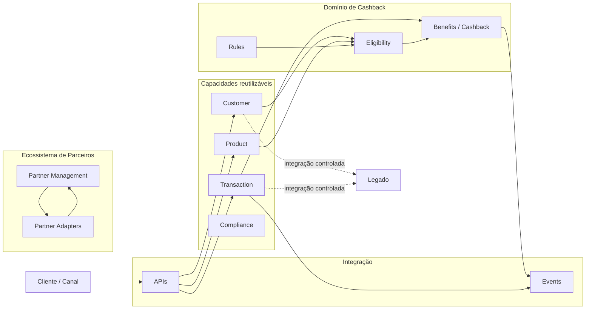
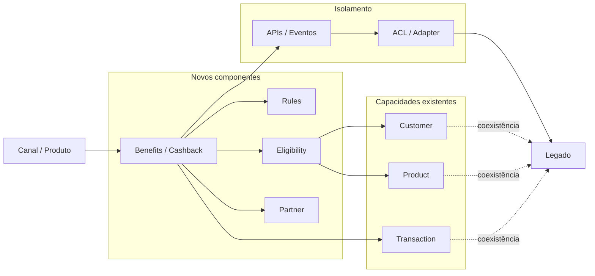
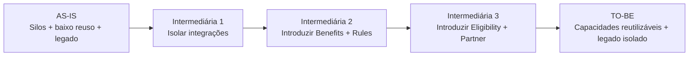

# Estrangulamentos, TO-BE e Arquitetura Intermediária — Cashback com Parcerias

## 1. Objetivo

Este documento estabelece a ponte entre a decisão registrada na ADR-002 e a definição detalhada da arquitetura.

A abordagem parte dos estrangulamentos identificados no cenário atual e os relaciona a dois estados arquiteturais:

- **TO-BE:** estado arquitetural desejado;
- **Arquitetura Intermediária:** estado necessário para evoluir do AS-IS para o TO-BE sem exigir uma transformação de uma única vez.

A arquitetura intermediária não representa a arquitetura final. Ela representa uma etapa controlada de evolução.

---

## 2. Premissas

A análise considera como fatos do caso:

- o banco possui um portfólio predominantemente relacionado a crédito;
- as capacidades foram construídas em silos;
- existe pouco reuso entre capacidades;
- o legado impacta a cadeia de valor;
- o banco busca ampliar o portfólio e aumentar o engajamento;
- Cashback com Parcerias foi selecionado como primeiro cenário de transformação arquitetural;
- a arquitetura atual utiliza Microservices;
- a Architecture Vision deve preservar o estilo arquitetural atual;
- a possibilidade de adoção de Core Banking continua sendo uma alternativa a ser avaliada, e não uma decisão tomada.

O caso não fornece um inventário detalhado dos sistemas atuais. Portanto, os componentes de AS-IS apresentados neste documento devem ser tratados como representação arquitetural de trabalho, e não como inventário factual de sistemas.

---

# 3. Estrangulamentos Arquiteturais

## 3.1 Estrangulamento 1 — Capacidades em silos

### Situação

As capacidades existentes foram construídas de forma isolada, reduzindo a possibilidade de composição e reutilização para novos produtos.

### Impacto

A criação de um novo produto tende a depender da construção ou adaptação de capacidades já existentes.

### Evidência do caso

O caso informa que as capacidades foram construídas em silos e possuem pouco reuso.

### Direção arquitetural

Transformar capacidades relevantes em Building Blocks reutilizáveis e acessíveis por contratos explícitos.

---

## 3.2 Estrangulamento 2 — Baixo reuso

### Situação

Existe pouco reaproveitamento das capacidades existentes entre produtos.

### Impacto

A expansão do portfólio pode continuar reproduzindo soluções específicas para cada produto.

### Direção arquitetural

Cashback deve consumir capacidades existentes de:

- Cliente;
- Produto;
- Transação;
- Compliance, quando aplicável.

As novas capacidades devem ser desenhadas para também poderem ser reutilizadas por produtos futuros.

---

## 3.3 Estrangulamento 3 — Dependência do legado

### Situação

O legado possui impacto sobre a cadeia de valor.

### Impacto

Alterações em novos produtos podem ficar condicionadas a componentes ou integrações legadas.

### Direção arquitetural

Introduzir uma camada explícita de isolamento entre os novos contextos e o legado, utilizando contratos e adaptadores quando necessário.

O objetivo não é eliminar o legado imediatamente, mas impedir que ele determine a evolução de novos produtos.

---

## 3.4 Estrangulamento 4 — Integrações pouco explícitas

### Situação

A existência de capacidades em silos aumenta a possibilidade de integrações específicas e acoplamentos entre soluções.

### Impacto

A evolução de um produto pode gerar impactos em outros componentes.

### Direção arquitetural

Estabelecer contratos de integração claros, APIs e/ou eventos conforme o caso, evitando dependências internas não explicitadas.

---

## 3.5 Estrangulamento 5 — Regras de negócio acopladas ao produto

### Situação

No cenário de Cashback, existe uma necessidade explícita de regras, elegibilidade, cálculo e concessão do benefício.

### Impacto

Se essas regras forem implementadas diretamente dentro de um produto ou integração específica, o banco poderá criar outro silo.

### Direção arquitetural

Separar:

- Programa de Cashback;
- Benefício;
- Regra;
- Elegibilidade;
- Concessão;
- Histórico.

Essa separação permite evolução independente das regras e potencial reutilização.

---

## 3.6 Estrangulamento 6 — Integração com parceiros

### Situação

O cenário escolhido introduz parceiros externos.

### Impacto

Cada parceiro pode possuir contratos, formatos e mecanismos de integração diferentes.

### Direção arquitetural

Isolar a complexidade de cada parceiro por meio de um contexto/camada de integração, evitando que o domínio de Cashback conheça diretamente detalhes específicos de cada parceiro.

---

# 4. Matriz de Estrangulamento → Resposta Arquitetural

| Estrangulamento | Impacto | Resposta TO-BE | Resposta Intermediária |
|---|---|---|---|
| Capacidades em silos | Baixa composição | Building Blocks reutilizáveis | Expor primeiro as capacidades necessárias ao Cashback |
| Baixo reuso | Duplicação | Customer/Product/Transaction reutilizáveis | Criar contratos de consumo sem reconstruir capacidades |
| Dependência do legado | Acoplamento | Legado isolado | ACL/Adapter entre novos componentes e legado |
| Integrações pouco explícitas | Acoplamento | APIs/Eventos/Contratos | Criar contratos apenas nos pontos necessários à evolução |
| Regras acopladas | Novo silo | Rules/Elegibility/Benefits separados | Extrair gradualmente regras do fluxo atual |
| Parceiros heterogêneos | Complexidade externa | Partner Context + adapters | Introduzir primeiro uma abstração de parceiro |

---

# 5. Arquitetura TO-BE

## 5.1 Visão conceitual

O TO-BE representa a arquitetura desejada para suportar Cashback com Parcerias e, principalmente, permitir que as capacidades criadas possam ser utilizadas por futuros produtos.



O desenho representa uma direção arquitetural. Ele não define ainda a quantidade final de microservices nem seus contratos técnicos.

---

# 6. Princípios do TO-BE

## 6.1 Reuso antes de duplicação

Antes de criar uma nova capacidade, verificar se Customer, Product, Transaction ou outra capacidade existente pode ser reutilizada.

## 6.2 Domínio antes de tecnologia

Os limites de negócio devem orientar os limites dos componentes. A definição de Microservices será posterior à definição dos limites de domínio.

## 6.3 Legado não deve definir o novo domínio

O legado pode continuar existindo, mas seus detalhes devem ficar isolados dos novos contextos.

## 6.4 Contratos explícitos

Integrações entre capacidades devem possuir contratos claros.

## 6.5 Evolução incremental

A arquitetura deve permitir coexistência entre componentes existentes e novos componentes durante a migração.

## 6.6 Cashback não pode se tornar outro silo

O novo cenário deve utilizar capacidades compartilhadas e produzir Building Blocks que possam ser reutilizados posteriormente.

---

# 7. Arquitetura Intermediária

## 7.1 Objetivo

A arquitetura intermediária existe para resolver o estrangulamento sem exigir que todo o TO-BE esteja disponível imediatamente.

Ela permite:

1. introduzir as novas capacidades;
2. reutilizar capacidades existentes;
3. isolar o legado;
4. estabelecer contratos;
5. migrar responsabilidades gradualmente.

---

## 7.2 Estado intermediário conceitual



O ponto central da arquitetura intermediária é a **coexistência controlada**.

Os novos componentes não precisam esperar a modernização completa do legado para começar a entregar a capacidade de Cashback.

---

# 8. Evolução entre os estados



## Intermediária 1 — Isolamento

Prioridade:

- identificar dependências do Cashback;
- definir contratos;
- criar adapters/ACL para legado quando necessário;
- evitar acesso direto dos novos componentes ao legado.

Resultado esperado:

> O novo domínio começa a evoluir sem incorporar diretamente as restrições internas do legado.

---

## Intermediária 2 — Benefits e Rules

Prioridade:

- introduzir Benefits/Cashback;
- separar regras;
- consumir Customer, Product e Transaction existentes;
- registrar os eventos necessários.

Resultado esperado:

> O banco passa a possuir uma capacidade explícita de benefícios sem reconstruir toda a arquitetura bancária.

---

## Intermediária 3 — Eligibility e Partner

Prioridade:

- tornar elegibilidade explícita;
- introduzir Partner Management;
- encapsular integrações externas;
- ampliar contratos e eventos.

Resultado esperado:

> O cenário passa a suportar múltiplos parceiros e regras evolutivas sem criar integrações específicas dentro do domínio de Cashback.

---

## TO-BE — Consolidação

Prioridade:

- consolidar Building Blocks;
- reduzir dependências legadas;
- ampliar reutilização;
- consolidar contratos;
- preparar capacidades para novos produtos.

Resultado esperado:

> Cashback deixa de ser uma solução específica e passa a funcionar como primeiro caso de uso da evolução arquitetural do banco.

---

# 9. O que muda entre Intermediário e TO-BE

| Dimensão | Intermediário | TO-BE |
|---|---|---|
| Legado | Ainda participa da solução | Isolado e progressivamente reduzido |
| Customer | Pode continuar sendo consumido da arquitetura existente | Capacidade reutilizável |
| Product | Pode continuar sendo consumido da arquitetura existente | Capacidade reutilizável |
| Transaction | Fonte existente para o fluxo | Capacidade/Building Block reutilizável |
| Benefits | Novo componente | Capacidade consolidada |
| Rules | Novo componente | Capacidade desacoplada e evolutiva |
| Eligibility | Introduzida progressivamente | Contexto explícito |
| Partner | Integração inicialmente controlada | Capacidade de negócio isolada |
| Integração | ACL/Adapters + contratos iniciais | Contratos consolidados |
| Microservices | Mantidos | Mantidos |
| Reuso | Começa a ser habilitado | Princípio estrutural |
| Migração | Coexistência | Estado arquitetural estabilizado |

---

# 10. O que não devemos decidir ainda

Este documento não define:

- quantidade final de Microservices;
- tecnologia específica;
- banco de dados de cada serviço;
- protocolo de cada integração;
- estratégia definitiva de eventos;
- substituição do Core Banking;
- substituição imediata do legado;
- topologia final de infraestrutura.

Essas decisões devem ser derivadas dos próximos níveis de arquitetura.

---

# 11. Relação com Core Banking

A arquitetura intermediária não pressupõe a aquisição de uma plataforma Core Banking.

O Core Banking permanece como alternativa arquitetural a ser avaliada separadamente.

A pergunta correta continua sendo:

> Quais capacidades atuais e futuras deveriam ser providas por uma plataforma Core Banking, e quais devem permanecer como capacidades próprias do banco?

Essa avaliação exige uma análise de fit/gap que não está disponível no caso.

---

# 12. Building Blocks candidatos

A partir dos estrangulamentos, os primeiros Building Blocks candidatos são:

### Reutilização

- Customer Management
- Product Management
- Transaction Management

### Cashback

- Benefits Management
- Cashback Rules
- Eligibility Management
- Benefit Granting

### Parceiros

- Partner Management
- Partner Integration Adapter

### Integração

- API Layer
- Event Integration
- Legacy Adapter / ACL

Esses são Building Blocks candidatos. A decomposição definitiva em Microservices será tratada posteriormente.

---

# 13. Traceabilidade

```text
ADR-002
  │
  └── Escolha: Cashback com Parcerias
          │
          ├── Estrangulamento: silos
          │       └──> Building Blocks reutilizáveis
          │
          ├── Estrangulamento: baixo reuso
          │       └──> Customer/Product/Transaction compartilhados
          │
          ├── Estrangulamento: legado
          │       └──> ACL / Adapter / coexistência
          │
          ├── Estrangulamento: regras acopladas
          │       └──> Rules + Eligibility + Benefits
          │
          └── Estrangulamento: parceiros
                  └──> Partner + Adapters

        ┌───────────────────────────┐
        │ Arquitetura Intermediária │
        └─────────────┬─────────────┘
                      │
                      ▼
                ┌──────────┐
                │  TO-BE   │
                └──────────┘
```

---

# 14. Decisão arquitetural decorrente

A decisão não é apenas:

> “Vamos construir Cashback.”

A decisão arquitetural é:

> **Utilizar Cashback com Parcerias como primeiro veículo de evolução arquitetural, atacando os estrangulamentos de silo, baixo reuso, dependência do legado e integrações específicas por meio de uma arquitetura intermediária que evolui progressivamente para um TO-BE baseado em capacidades reutilizáveis, domínios explícitos, contratos e isolamento do legado.**

Isso mantém a decisão da ADR-002 e cria uma linha de evolução verificável para os próximos artefatos.

---

# 15. Próximo nível de arquitetura

A sequência recomendada a partir deste documento é:

```text
Estrangulamentos
      ↓
TO-BE + Intermediárias
      ↓
Building Blocks
      ↓
Application Architecture
      ↓
DDD Tático
      ↓
Bounded Contexts
      ↓
Microservices
      ↓
Contratos / APIs / Eventos
      ↓
Plano de Migração
```

A definição detalhada de Microservices deve ocorrer depois da definição dos limites de domínio e dos Building Blocks.
