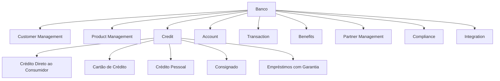
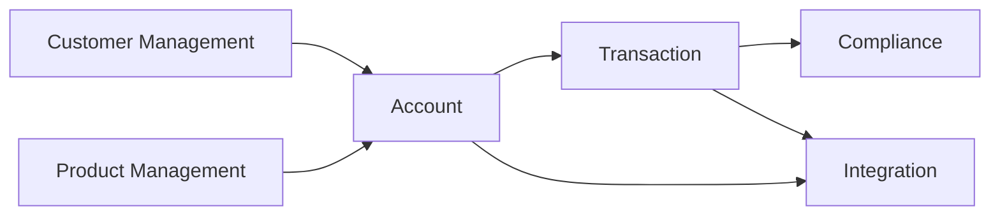
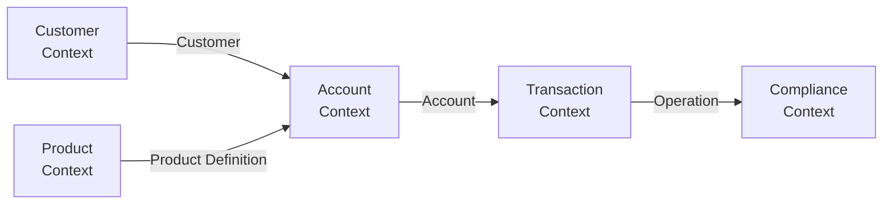
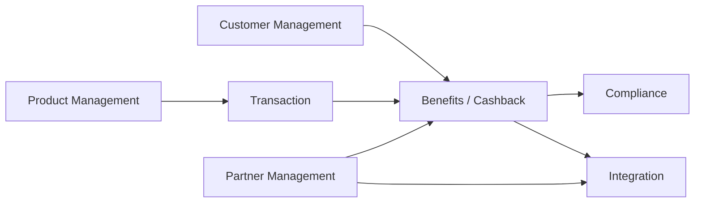
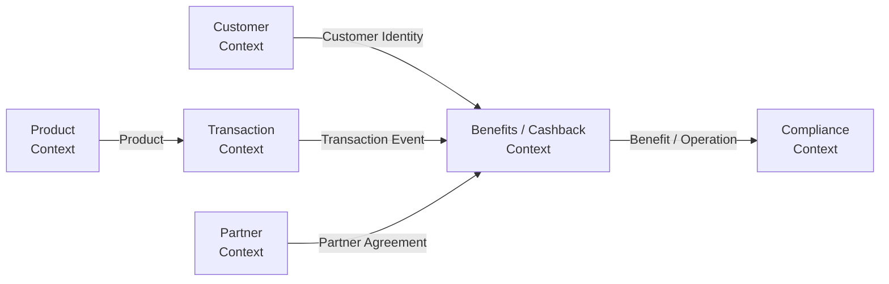
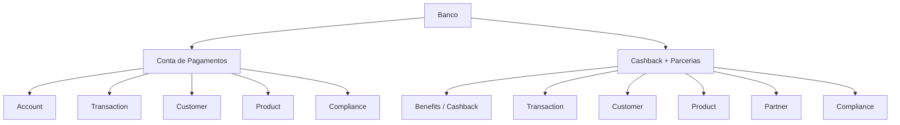
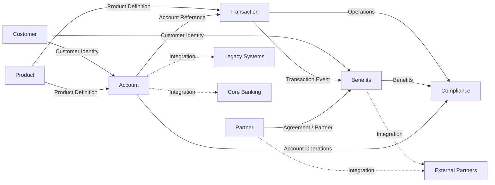
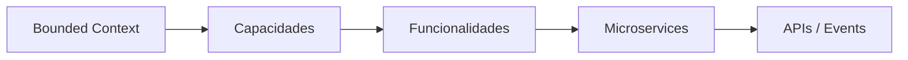

# Bounded Contexts — Modelo Geral e Cenários

## 1. Objetivo

Este documento apresenta uma primeira proposta de **Bounded Contexts** para o banco e sua aplicação nos dois cenários avaliados:

- Conta de Pagamentos;
- Cashback com Parcerias.

O objetivo é estabelecer fronteiras de modelo e responsabilidade de negócio antes da decomposição tecnológica em Microservices.

O case informa que as capacidades atuais foram construídas em silos e possuem pouco reaproveitamento. Portanto, o desenho dos Bounded Contexts deve ajudar a explicitar limites de negócio e reduzir o acoplamento entre os diferentes produtos.

> **Importante:** Bounded Context não é sinônimo de Microservice. Um Bounded Context representa uma fronteira de modelo e responsabilidade de negócio. A decisão de decompor essa fronteira em um ou mais Microservices é posterior.

---

# 2. Bounded Contexts Gerais do Banco

Uma primeira visão do banco pode ser organizada nos seguintes contextos:



## 2.1 Customer Management

Responsável pelo conceito de cliente utilizado pelos demais contextos.

Possíveis responsabilidades:

- identificação do cliente;
- dados cadastrais;
- relacionamento com produtos;
- informações necessárias para elegibilidade.

### Conceito principal

`Customer`

---

## 2.2 Product Management

Responsável pela visão de produto do banco.

Possíveis responsabilidades:

- definição de produtos;
- características do produto;
- ciclo de vida do produto;
- composição e parametrização de ofertas.

### Conceito principal

`Product`

---

## 2.3 Credit

Representa o domínio de crédito que atualmente possui grande relevância no portfólio do banco.

O case cita:

- Crédito Direto ao Consumidor;
- Cartão de Crédito;
- Crédito Pessoal;
- Consignado;
- Empréstimos com garantia.

Uma decomposição posterior poderá avaliar se todos esses produtos pertencem ao mesmo Bounded Context ou se devem ser separados em contextos distintos.

### Conceitos principais

`Credit`

`Loan`

`Credit Product`

---

## 2.4 Account

Representa a gestão de contas financeiras.

No cenário atual, esse contexto precisa ser investigado para determinar quais capacidades já existem e quais seriam necessárias para suportar uma Conta de Pagamentos.

### Conceitos principais

`Account`

`Account Holder`

`Account Status`

---

## 2.5 Transaction

Responsável pelo conceito de transação financeira.

Possíveis responsabilidades:

- registro de transações;
- identificação da operação;
- processamento;
- consulta;
- integração com outros contextos.

### Conceito principal

`Transaction`

---

## 2.6 Benefits

Contexto relacionado à gestão de benefícios oferecidos ao cliente.

No cenário do case, o principal candidato é o Cashback.

### Conceitos principais

`Benefit`

`Cashback`

`Benefit Rule`

---

## 2.7 Partner Management

Responsável pelo relacionamento com organizações externas que participam do ecossistema do banco.

É especialmente relevante para o cenário de Cashback.

### Conceitos principais

`Partner`

`Partnership`

`Agreement`

---

## 2.8 Compliance

Representa capacidades relacionadas aos controles e requisitos regulatórios.

O case não detalha suas regras, portanto esse contexto deve ser aprofundado posteriormente.

### Conceitos principais

`Compliance Rule`

`Control`

---

## 2.9 Integration

Responsável pelas fronteiras tecnológicas e integrações necessárias entre os contextos e sistemas externos.

Não deve necessariamente ser interpretado como um domínio de negócio central. Sua responsabilidade deve ser analisada principalmente como suporte à interoperabilidade.

### Conceitos principais

`Integration`

`Contract`

`Adapter`

---

# 3. Cenário A — Conta de Pagamentos

## 3.1 Bounded Contexts envolvidos

Para a Conta de Pagamentos, os principais contextos envolvidos seriam:



O contexto central do cenário é `Account`, com forte interação com `Transaction`.

## 3.2 Account Context

Neste cenário, `Account` passa a possuir uma responsabilidade explícita sobre a Conta de Pagamentos.

Seu modelo pode conter conceitos como:

```text
Account
 ├── Account Holder
 ├── Account Status
 ├── Account Type
 └── Account Lifecycle
```

Responsabilidades:

- abertura;
- manutenção;
- bloqueio/desbloqueio;
- encerramento;
- consulta das informações da conta.

O contexto não deveria assumir responsabilidades que pertencem a `Transaction`.

---

## 3.3 Transaction Context

O contexto de transação representa as movimentações realizadas sobre a Conta de Pagamentos.

```text
Transaction
 ├── Transaction Type
 ├── Amount
 ├── Date/Time
 ├── Status
 └── Account Reference
```

Responsabilidades:

- registrar transações;
- processar operações;
- consultar histórico;
- fornecer informações necessárias para outros contextos.

---

## 3.4 Customer Context

O `Customer Management` fornece a identidade e os dados necessários do cliente.

Uma regra importante é evitar que `Account` passe a ser o dono dos dados cadastrais do cliente.

```text
Customer Management
        │
        │ Customer
        ▼
Account
```

O `Account` referencia o cliente, mas não necessariamente replica seu modelo completo.

---

## 3.5 Product Context

`Product Management` define as características comerciais e de produto da Conta de Pagamentos.

```text
Product
   │
   │ Product Definition
   ▼
Account
```

A separação permite que o conceito de produto não seja confundido com o conceito de conta.

---

## 3.6 Relação entre os contextos



---

# 4. Cenário B — Cashback com Parcerias

## 4.1 Bounded Contexts envolvidos

Para o cenário de Cashback, a composição muda:



Neste cenário, o contexto central passa a ser `Benefits / Cashback`.

---

## 4.2 Benefits / Cashback Context

Este é o principal Bounded Context específico do cenário.

Seu modelo pode conter:

```text
Cashback
 ├── Eligibility
 ├── Rule
 ├── Calculation
 ├── Benefit
 └── Benefit Status
```

Responsabilidades:

- definir/aplicar regras;
- determinar elegibilidade;
- calcular benefício;
- registrar benefício;
- controlar estado do benefício;
- disponibilizar histórico do benefício.

O contexto não deve assumir a responsabilidade de ser o dono da transação original.

---

## 4.3 Transaction Context

A transação é a origem de uma informação necessária para o Cashback, mas isso não significa que `Transaction` e `Cashback` devam compartilhar o mesmo modelo.

A relação conceitual seria:

```text
Transaction
     │
     │ evento / informação
     ▼
Cashback
     │
     ▼
Eligibility
     │
     ▼
Rule
     │
     ▼
Calculation
     │
     ▼
Benefit
```

Isso permite que uma alteração no modelo interno de `Transaction` não obrigue necessariamente uma alteração no modelo interno de `Cashback`, desde que o contrato entre os contextos permaneça estável.

---

## 4.4 Partner Management Context

O parceiro possui um modelo próprio.

```text
Partner
 ├── Partner Identity
 ├── Partnership
 ├── Agreement
 └── Partner Status
```

O `Benefits / Cashback` referencia o parceiro necessário para a aplicação das regras, mas não deve necessariamente possuir todo o modelo de relacionamento comercial.

---

## 4.5 Customer Context

O Cashback precisa identificar o cliente e suas condições de elegibilidade.

A responsabilidade pelo cadastro do cliente permanece no `Customer Management`.

```text
Customer Management
        │
        │ Customer Identity
        ▼
Benefits / Cashback
```

---

## 4.6 Relação entre os contextos



---

# 5. Comparação dos Bounded Contexts



A diferença estrutural pode ser resumida assim:

| Aspecto | Conta de Pagamentos | Cashback + Parcerias |
|---|---|---|
| Bounded Context central | Account | Benefits / Cashback |
| Contexto de maior interação | Transaction | Transaction |
| Cliente | Customer Management | Customer Management |
| Produto | Product Management | Product Management |
| Parceiro | Não é central | Partner Management |
| Benefício | Não é central | Benefits / Cashback |
| Conta | Central | Pode ser uma dependência |
| Transação | Fundamental | Fundamental como entrada do processo |
| Compliance | Transversal | Transversal |
| Integração | Legado/Core | Legado/Parceiros |

---

# 6. Context Map — Visão Consolidada

Uma visão inicial de relacionamento entre os Bounded Contexts pode ser representada desta forma:



## 6.1 Leitura do Context Map

O ponto importante desse modelo é que os contextos possuem **modelos próprios**, mesmo quando representam conceitos relacionados.

Por exemplo:

```text
Customer
    │
    ├── Account Context
    │       └── Account Holder
    │
    └── Cashback Context
            └── Eligible Customer
```

O mesmo cliente pode ser representado de maneiras diferentes em cada contexto, conforme a responsabilidade de negócio.

Da mesma forma:

```text
Transaction
      │
      ├── Account Context
      │       └── Account Transaction
      │
      └── Cashback Context
              └── Eligible Transaction
```

Isso evita a criação de um modelo corporativo único e excessivamente acoplado.

---

# 7. Relação com Microservices

Somente após os Bounded Contexts e suas responsabilidades estarem suficientemente definidos deve-se avaliar a decomposição tecnológica.

Uma possível evolução seria:



Portanto:

```text
Bounded Context
        ≠
Microservice
```

Um Bounded Context pode resultar em um ou mais serviços, dependendo de:

- volume;
- autonomia;
- ciclo de mudança;
- requisitos de escala;
- ownership;
- consistência;
- dependências;
- características operacionais.

---

# 8. Pontos a validar

O case não fornece informações suficientes para fechar definitivamente os Bounded Contexts. Os seguintes pontos deverão ser validados nas próximas etapas:

1. Se `Account` já existe na arquitetura atual.
2. Quais capacidades atuais podem ser reutilizadas.
3. Qual é o limite entre `Account` e `Transaction`.
4. Se `Transaction` deve ser um contexto corporativo compartilhado.
5. Quais capacidades pertencem ao domínio de `Benefits`.
6. Se `Partner Management` já existe.
7. Qual é o limite de responsabilidade do eventual Core Bancário.
8. Quais capacidades permanecerão no legado.
9. Quais contextos representam diferencial de negócio.
10. Quais contextos devem ser classificados como Core, Supporting ou Generic.

---

# 9. Próxima etapa

A evolução natural deste modelo é:

```text
Bounded Contexts
       ↓
Context Map
       ↓
Classificação
(Core / Supporting / Generic)
       ↓
Capacidades
       ↓
Value Streams
       ↓
Functional Decomposition
       ↓
Building Blocks
       ↓
Microservices
```

A classificação dos Bounded Contexts e a definição dos relacionamentos do Context Map devem preceder a decisão de decomposição em Microservices.
