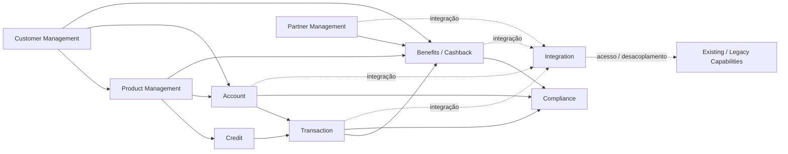
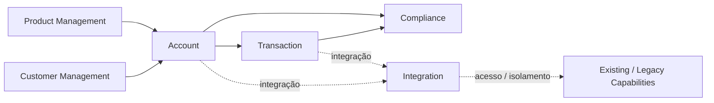
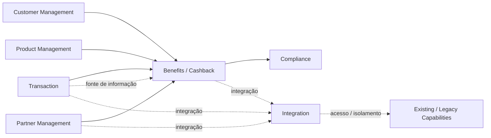
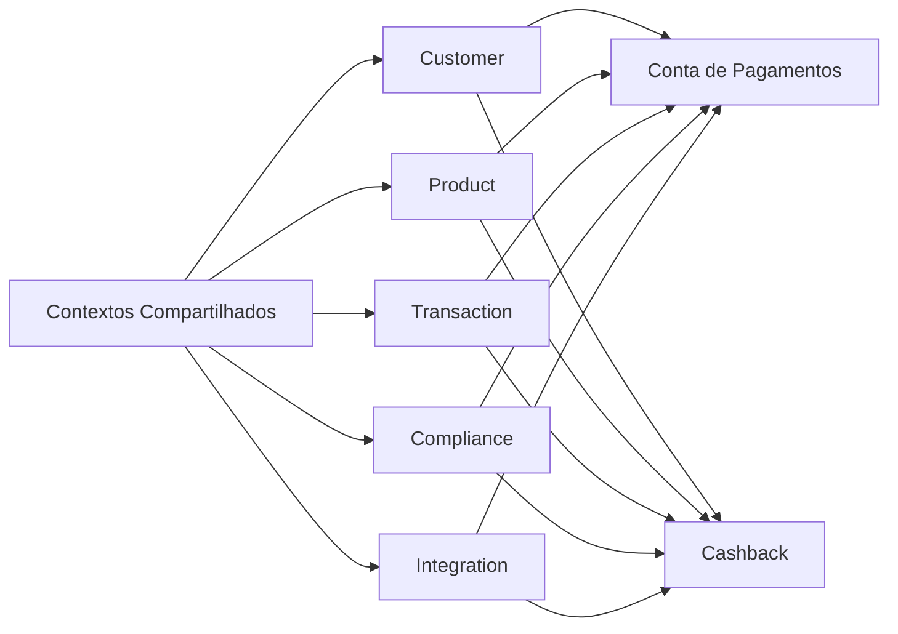
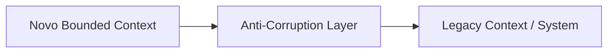
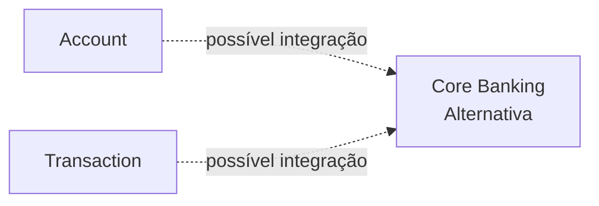
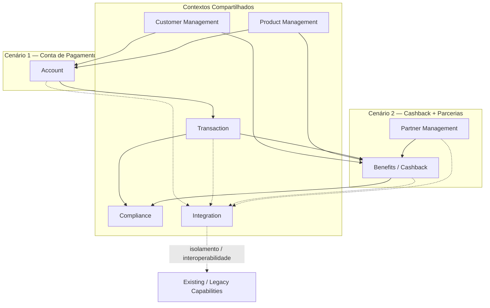

# Context Map — AS-IS e Cenários

## 1. Objetivo

Este documento apresenta o **Context Map (Mapa de Contextos)** da análise arquitetural do case, conectando os Bounded Contexts identificados com as relações de negócio e integração entre eles.

O objetivo é:

- visualizar os limites entre os contextos;
- identificar dependências entre contextos;
- evidenciar relações de interoperabilidade;
- comparar os dois cenários;
- apoiar a análise de impacto do legado;
- criar uma base para a definição da arquitetura TO-BE.

Este documento não representa um inventário confirmado da arquitetura real do banco. Quando a informação não é explicitamente fornecida pelo case, ela é tratada como **hipótese arquitetural**.

---

# 2. Contexto do AS-IS

O case informa que:

- o banco possui portfólio predominantemente baseado em produtos de crédito;
- existem produtos como CDC, Cartão de Crédito, Crédito Pessoal, Consignado e Empréstimos com Garantia;
- as capacidades foram construídas em silos;
- existe pouco reaproveitamento;
- o legado impacta a cadeia de valor;
- o estilo arquitetural atual é Microservices.

O case não fornece o catálogo real de Bounded Contexts, Microservices, APIs ou integrações existentes.

Portanto, o mapa abaixo representa uma **visão conceitual derivada do problema informado**.

---

# 3. Bounded Contexts Identificados

A análise dos cenários levou à identificação dos seguintes contextos candidatos:

| Bounded Context | Origem | Status |
|---|---|---|
| Customer Management | Necessidade transversal | Hipótese |
| Product Management | Necessidade transversal | Hipótese |
| Credit | Portfólio atual | Hipótese |
| Account | Cenário Conta de Pagamentos | Hipótese |
| Transaction | Necessidade transversal dos cenários | Hipótese |
| Benefits / Cashback | Cenário Cashback | Hipótese |
| Partner Management | Cenário Cashback com Parcerias | Hipótese |
| Compliance | Necessidade bancária / cenários | Hipótese |
| Integration | Interoperabilidade e legado | Hipótese |

Importante:

```text
Bounded Context ≠ Microservice
```

Um Bounded Context representa um limite semântico e organizacional do domínio. A decisão sobre quantidade e granularidade de Microservices deverá ocorrer posteriormente.

---

# 4. Context Map — Visão Geral



Este é um **Context Map conceitual**, e não uma descrição confirmada das integrações atuais.

---

# 5. Relações Conceituais

## 5.1 Customer Management

O contexto de Customer Management representa informações e capacidades relacionadas ao cliente.

Relações candidatas:

```text
Customer
   ├──→ Product
   ├──→ Account
   └──→ Benefits
```

Essas relações são derivadas das necessidades funcionais dos cenários.

---

## 5.2 Product Management

Product Management representa o contexto responsável pela definição e administração dos produtos.

Relações candidatas:

```text
Product
   ├──→ Credit
   ├──→ Account
   └──→ Benefits
```

No cenário de Cashback, essa relação é particularmente relevante porque o benefício pode estar associado a produtos, ofertas ou jornadas existentes.

---

## 5.3 Credit

Credit representa o domínio atualmente mais evidente no portfólio informado pelo case.

```text
Credit
 ├── CDC
 ├── Cartão de Crédito
 ├── Crédito Pessoal
 ├── Consignado
 └── Empréstimos com Garantia
```

Os produtos acima são fatos fornecidos pelo case.

O agrupamento `Credit` como Bounded Context é uma **hipótese arquitetural**, que deverá ser validada posteriormente.

---

# 6. Context Map — Cenário 1: Conta de Pagamentos



## 6.1 Relações principais

### Customer → Account

O contexto de Account necessita identificar o cliente associado à conta.

Relação conceitual:

```text
Customer
    ↓
Account
```

### Product → Account

A Conta de Pagamentos é tratada como produto/capacidade de negócio que precisa estar relacionada à gestão de produtos.

```text
Product
    ↓
Account
```

### Account → Transaction

As transações representam movimentações associadas à conta.

```text
Account
    ↓
Transaction
```

### Transaction → Compliance

Operações financeiras podem estar sujeitas a controles e regras de compliance.

Essa relação é uma hipótese de arquitetura de negócio e deverá ser detalhada posteriormente.

### Account / Transaction → Integration

O contexto de integração representa o ponto conceitual de interoperabilidade com capacidades existentes e legado.

---

# 7. Context Map — Cenário 2: Cashback com Parcerias



## 7.1 Relações principais

### Customer → Benefits

O cliente é o beneficiário do programa.

```text
Customer
    ↓
Benefits
```

### Product → Benefits

O programa pode estar relacionado a produtos ou ofertas do banco.

```text
Product
    ↓
Benefits
```

Essa relação precisa ser detalhada durante o levantamento de regras.

### Transaction → Benefits

A transação pode fornecer os dados necessários para determinar a elegibilidade e calcular o benefício.

```text
Transaction
    ↓
Benefits
```

Essa relação é uma das principais características do cenário.

### Partner → Benefits

O programa possui parcerias.

```text
Partner
    ↓
Benefits
```

O modelo operacional dessa parceria não é especificado pelo case e deverá ser validado.

---

# 8. Comparação dos Context Maps

## Conta de Pagamentos

```text
Customer
   ↓
Account
   ↓
Transaction
   ↓
Compliance
```

O núcleo do cenário está relacionado à gestão da conta e sua movimentação.

## Cashback

```text
Customer
      ↓
Product ──────┐
              ↓
Transaction → Benefits ← Partner
                  ↓
              Compliance
```

O núcleo do cenário está relacionado à gestão de benefícios, regras, elegibilidade e parceiros, utilizando informações provenientes das transações.

---

# 9. Contextos Compartilhados

Os dois cenários apresentam um conjunto relevante de contextos potencialmente compartilhados:



Essa sobreposição é importante para a análise de reutilização.

Ela permite investigar se a arquitetura do novo produto pode gerar Building Blocks reutilizáveis para outros produtos.

---

# 10. Contextos Específicos

## Conta de Pagamentos

```text
Account
```

É o principal contexto específico identificado para esse cenário.

## Cashback

```text
Benefits / Cashback
Partner Management
```

São os principais contextos específicos identificados para esse cenário.

Além deles, regras e elegibilidade podem permanecer dentro de Benefits ou ser separados posteriormente, dependendo da análise de domínio.

---

# 11. Relação com o AS-IS

O problema informado pelo case é:

```text
Capacidades em silos
       +
Pouco reaproveitamento
       +
Legado impactando a cadeia de valor
```

O Context Map permite representar a consequência arquitetural desejada:

```text
             Contextos bem definidos
                       ↓
             Contratos explícitos
                       ↓
                Interoperabilidade
                       ↓
             Reutilização de capacidades
                       ↓
              Menor acoplamento
                       ↓
              Evolução de produtos
```

A sequência acima é uma **hipótese arquitetural**, não uma afirmação de que esses benefícios já existam.

---

# 12. Padrões de Relacionamento DDD

Neste momento, não devemos afirmar que os relacionamentos atuais utilizam formalmente padrões específicos de Context Mapping.

Entretanto, os seguintes padrões podem ser avaliados no TO-BE:

| Relação | Padrão a avaliar |
|---|---|
| Customer → Account | Customer/Supplier ou Published Language |
| Product → Account | Customer/Supplier |
| Account → Transaction | Customer/Supplier |
| Transaction → Benefits | Published Language / Customer-Supplier |
| Partner → Benefits | Customer/Supplier |
| Contextos internos → Legacy | Anti-Corruption Layer |
| Partner → Integration | Anti-Corruption Layer / Gateway |

Esses são **candidatos para avaliação**, não decisões.

---

# 13. Anti-Corruption Layer

O problema de legado torna o ACL particularmente relevante para o TO-BE.

A intenção seria evitar que conceitos do legado contaminem diretamente os novos contextos.



Exemplo conceitual:

```text
Benefits
   ↓
ACL
   ↓
Legacy Transaction Capability
```

O novo domínio mantém sua própria linguagem e modelo, enquanto o ACL traduz conceitos quando necessário.

---

# 14. Context Map e Reuso

O Context Map permite identificar dois níveis de reuso.

## Reuso de capacidades

```text
Customer
Product
Transaction
Compliance
Integration
```

podem potencialmente ser utilizados pelos dois cenários.

## Reuso arquitetural

Além das capacidades, podem existir Building Blocks reutilizáveis:

```text
API Gateway
Integration Adapter
Customer API
Transaction API
Event Contract
Audit
Rules Infrastructure
```

Esses elementos ainda são candidatos e não devem ser tratados como existentes no AS-IS.

---

# 15. Context Map e Core Bancário

O Core Bancário não é representado como Bounded Context existente no AS-IS.

Ele deve entrar como uma alternativa:



A avaliação deverá responder:

1. Quais capacidades o Core fornece?
2. Quais capacidades permanecem sob responsabilidade do banco?
3. Como os Bounded Contexts se relacionariam com o Core?
4. Seria necessário um ACL?
5. O Core reduziria ou apenas deslocaria o problema de silos?
6. Qual seria o impacto na cadeia de valor?
7. Qual seria o impacto na evolução dos produtos?

---

# 16. Decisões Ainda Não Tomadas

O Context Map não fecha, por si só, as seguintes decisões:

- quantidade final de Bounded Contexts;
- granularidade dos contextos;
- quantidade de Microservices;
- ownership dos contextos;
- padrões definitivos de relacionamento DDD;
- utilização de eventos;
- contratação de Core Bancário;
- arquitetura final da Conta de Pagamentos;
- arquitetura final do Cashback.

Essas decisões pertencem às etapas seguintes.

---

# 17. Rastreabilidade

| Elemento | Origem |
|---|---|
| Credit | Portfólio informado pelo case |
| Account | Cenário Conta de Pagamentos |
| Benefits / Cashback | Cenário Cashback |
| Partner Management | Cashback com parcerias |
| Transaction | Necessidade funcional derivada dos cenários |
| Customer Management | Capacidade transversal hipotética |
| Product Management | Capacidade transversal hipotética |
| Compliance | Necessidade arquitetural hipotética a validar |
| Integration | Problema de interoperabilidade e legado |
| Anti-Corruption Layer | Padrão arquitetural candidato para isolamento do legado |

---

# 18. Context Map Consolidado



---

# 19. Posição do Context Map na Arquitetura

O Context Map deve ser utilizado como ponte entre a Business Architecture e a Application Architecture:

```text
Problemas de Negócio
        ↓
Subdomínios
        ↓
Capacidades
        ↓
Bounded Contexts
        ↓
Context Map
        ↓
Business Functions
        ↓
Building Blocks
        ↓
Application Components
        ↓
Microservices
```

Assim, o Context Map não define diretamente os Microservices.

Ele define os **limites e relações de domínio** que posteriormente orientarão a decomposição arquitetural.

---

# 20. Próxima Etapa

Com o Context Map estabelecido, a sequência recomendada é:

```text
AS-IS
  ↓
Capability Map
  ↓
Bounded Contexts
  ↓
Context Map
  ↓
Value Streams
  ↓
Gap Analysis
  ↓
ADR de decisão do cenário
  ↓
TO-BE
```

O próximo artefato deve cruzar os Context Maps com os **Value Streams dos dois cenários**. Isso permitirá avaliar quais relações realmente agregam valor, onde existe reuso e onde o legado cria fricção na cadeia de valor.
