# Capacidades de Negócio — Banco e Cenários

## 1. Objetivo

Este documento identifica e organiza as **Capacidades de Negócio** relevantes para o case, primeiro em uma visão geral do banco e depois nos dois cenários avaliados:

- Cenário 1 — Conta de Pagamentos;
- Cenário 2 — Cashback com Parcerias.

A capacidade representa **o que o negócio é capaz de fazer**, independentemente de como isso será implementado tecnologicamente.

Portanto:

```text
Capability ≠ Functionalidade ≠ Microservice
```

A capacidade deve ser estável em relação à implementação e servir como ponte entre a estratégia e a arquitetura.

---

# 2. Base do Case

O case informa que:

- o banco possui portfólio predominantemente baseado em produtos de crédito;
- são citados Crédito Direto ao Consumidor, Cartão de Crédito, Crédito Pessoal, Consignado e Empréstimos com garantia;
- as capacidades foram construídas em silos;
- existe pouco reaproveitamento;
- o legado impacta a cadeia de valor;
- o banco busca ampliar o portfólio e aumentar o engajamento;
- Conta de Pagamentos e Cashback com parcerias apresentaram bons resultados nos testes;
- o novo produto deve contribuir para melhorar a arquitetura e acelerar lançamentos;
- o estilo arquitetural atual é Microservices e deve ser preservado;
- a análise deve considerar arquitetura TO-BE e plano de migração para elementos não aderentes.

Esses pontos são a base para o mapa de capacidades.

---

# 3. Mapa de Capacidades — Visão Geral

Uma primeira decomposição estratégica:

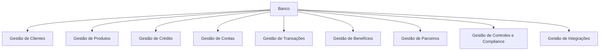

Esta é uma visão de primeiro nível. A decomposição abaixo é uma hipótese de trabalho e deve ser refinada conforme os processos e limites de negócio forem detalhados.

---

# 4. Classificação das Capacidades

Para apoiar a análise estratégica, as capacidades podem ser classificadas inicialmente em:

- **Core** — capacidade potencialmente relacionada à diferenciação competitiva e à estratégia do negócio.
- **Supporting** — capacidade necessária ao negócio, mas que não representa necessariamente diferenciação.
- **Generic** — capacidade comum, padronizável ou potencialmente adquirível como commodity.

A classificação abaixo é **inicial**. O case não fornece informação suficiente para fechar definitivamente todas as classificações.

| ID | Capacidade | Classificação inicial | Justificativa |
|---|---|---|---|
| CAP-001 | Gestão de Clientes | Supporting | Necessária para diversos produtos e jornadas. |
| CAP-002 | Gestão de Produtos | Supporting | Suporta composição e administração do portfólio. |
| CAP-003 | Gestão de Crédito | Core / existente | Representa o principal domínio do portfólio atual. |
| CAP-004 | Gestão de Contas | A avaliar | Torna-se relevante para o cenário de Conta de Pagamentos. |
| CAP-005 | Gestão de Transações | Supporting / a avaliar | Capacidade transversal potencialmente reutilizável. |
| CAP-006 | Gestão de Benefícios | A avaliar | Surge como capacidade relevante no cenário de Cashback. |
| CAP-007 | Gestão de Parceiros | Supporting / a avaliar | Necessária para o ecossistema de Cashback. |
| CAP-008 | Controles e Compliance | Generic / Supporting | Capacidade necessária ao setor bancário. |
| CAP-009 | Gestão de Integrações | Generic / Supporting | Capacidade transversal de interoperabilidade. |

A classificação deverá ser revisitada após o levantamento de valor, diferenciação e estratégia do banco.

---

# 5. Decomposição das Capacidades

## 5.1 Gestão de Clientes

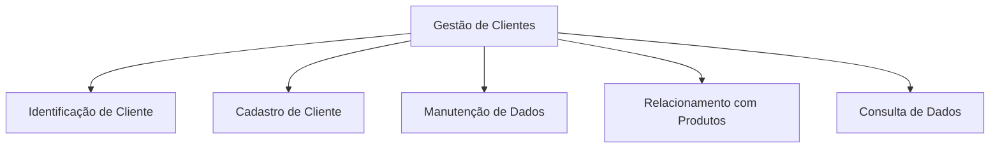

### Papel

Permitir que o banco mantenha e disponibilize informações necessárias sobre seus clientes.

### Reuso

Alta possibilidade de reutilização entre os dois cenários.

---

# 6. Gestão de Produtos

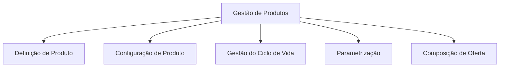

### Papel

Representar a capacidade do banco de estruturar e administrar seu portfólio.

### Reuso

Pode ser utilizada tanto pela Conta de Pagamentos quanto pelo Cashback.

---

# 7. Gestão de Crédito

O case informa que o portfólio atual possui forte concentração em crédito.

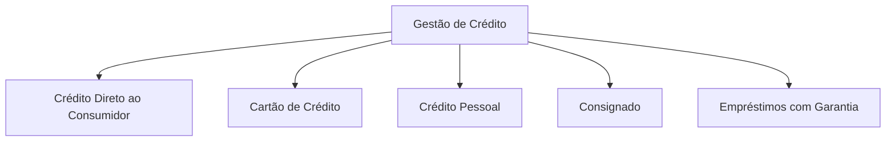

Neste momento, esses itens devem ser tratados como capacidades/produtos candidatos à decomposição, e não necessariamente como Bounded Contexts definitivos.

### Ponto arquitetural

O principal problema informado pelo case não é a existência dos produtos de crédito, mas o fato de suas capacidades terem sido construídas em silos e com pouco reaproveitamento.

---

# 8. Gestão de Contas

Capacidade especialmente relevante para o cenário de Conta de Pagamentos.

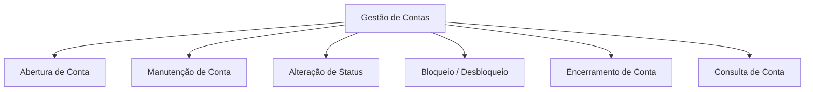

### Cenário relacionado

Conta de Pagamentos.

### Questão em aberto

O case não informa quais capacidades de conta já existem no banco. Portanto, não podemos afirmar que toda essa capacidade precisará ser construída.

---

# 9. Gestão de Transações

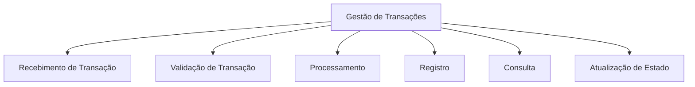

### Papel

Capacidade transversal potencialmente utilizada pelos dois cenários.

### Conta de Pagamentos

A transação representa uma operação sobre a conta.

### Cashback

A transação pode ser uma fonte de informação utilizada para determinar elegibilidade e calcular o benefício.

Essa diferença é importante:

```text
Conta de Pagamentos:
Account → Transaction

Cashback:
Transaction → Cashback
```

O sentido acima representa relação de negócio, não necessariamente dependência tecnológica.

---

# 10. Gestão de Benefícios

Capacidade específica que emerge com maior força no cenário de Cashback.

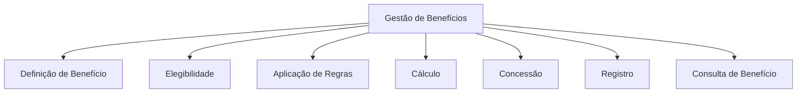

### Cenário relacionado

Cashback com Parcerias.

### Observação

O termo “Cashback” é tratado como uma forma específica de benefício dentro deste modelo. Essa definição deve ser validada com o negócio.

---

# 11. Gestão de Parceiros

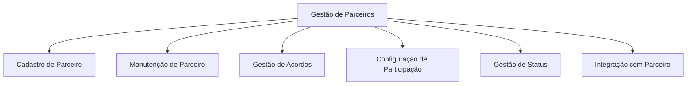

### Cenário relacionado

Cashback com Parcerias.

### Questão em aberto

O case informa que o programa possui parcerias, mas não define o modelo operacional ou comercial desses parceiros.

---

# 12. Controles e Compliance

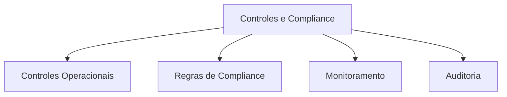

O case não detalha os requisitos regulatórios. Portanto, esta decomposição é apenas estrutural e deverá ser aprofundada posteriormente.

---

# 13. Gestão de Integrações

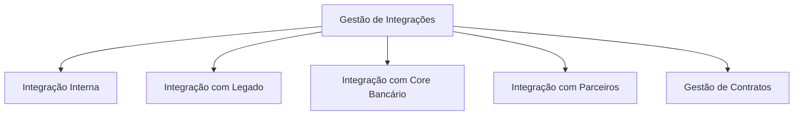

Essa capacidade é especialmente relevante devido ao impacto do legado e à necessidade de interoperabilidade.

---

# 14. Capacidades — Cenário 1: Conta de Pagamentos

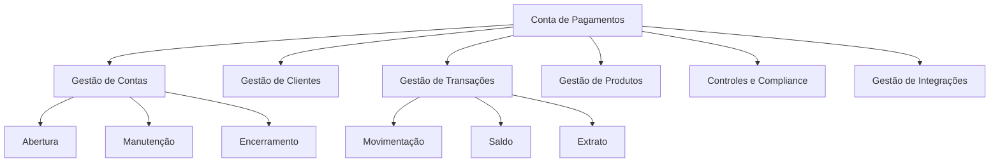

## Capacidades principais

| Capacidade | Importância no cenário |
|---|---|
| Gestão de Contas | Central |
| Gestão de Transações | Central |
| Gestão de Clientes | Necessária |
| Gestão de Produtos | Necessária |
| Controles e Compliance | Necessária |
| Gestão de Integrações | Necessária |

## Mapa de dependências conceituais

```text
Gestão de Clientes
        ↓
Gestão de Contas
        ↓
Gestão de Transações
        ↓
Controles / Compliance

Gestão de Produtos
        ↓
Gestão de Contas

Gestão de Integrações
        ↕
Todos os contextos necessários
```

---

# 15. Capacidades — Cenário 2: Cashback com Parcerias

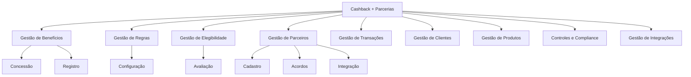

## Capacidades principais

| Capacidade | Importância no cenário |
|---|---|
| Gestão de Benefícios | Central |
| Gestão de Regras | Central |
| Gestão de Elegibilidade | Central |
| Gestão de Parceiros | Central |
| Gestão de Transações | Necessária |
| Gestão de Clientes | Necessária |
| Gestão de Produtos | Necessária |
| Controles e Compliance | Necessária |
| Gestão de Integrações | Central |

---

# 16. Comparação das Capacidades

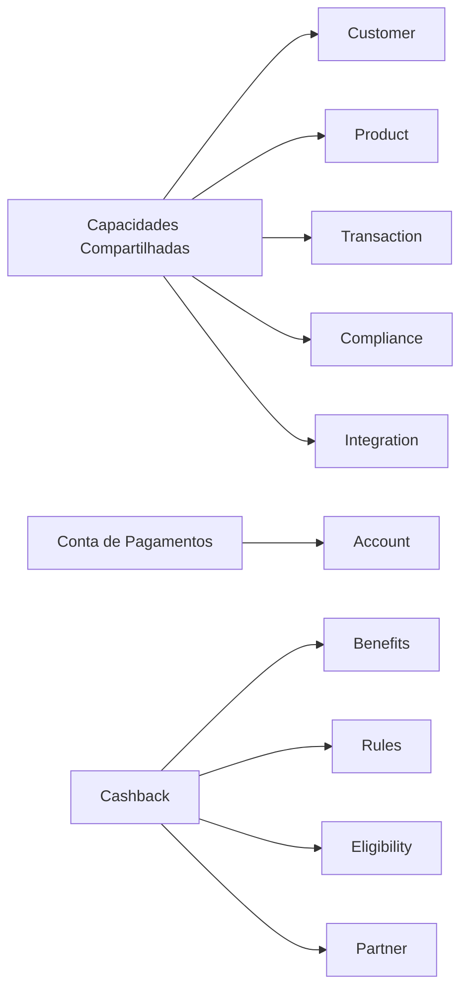

A visão evidencia uma possível área de reutilização:

```text
                 ┌── Conta de Pagamentos
                 │
Customer ────────┤
Product ─────────┤
Transaction ─────┤
Compliance ──────┤
Integration ─────┘

                 ┌── Cashback
                 │
Customer ────────┤
Product ─────────┤
Transaction ─────┤
Compliance ──────┤
Integration ─────┘
```

As capacidades específicas aparecem em pontos diferentes:

```text
Conta de Pagamentos
        ↓
Gestão de Contas

Cashback
        ↓
Gestão de Benefícios
Gestão de Regras
Gestão de Elegibilidade
Gestão de Parceiros
```

---

# 17. Matriz de Reutilização

| Capacidade | Conta de Pagamentos | Cashback | Potencial de Reuso |
|---|---:|---:|---|
| Gestão de Clientes | ✓ | ✓ | Alto |
| Gestão de Produtos | ✓ | ✓ | Alto |
| Gestão de Transações | ✓ | ✓ | Alto |
| Controles e Compliance | ✓ | ✓ | Alto |
| Gestão de Integrações | ✓ | ✓ | Alto |
| Gestão de Contas | ✓ | — | Específico |
| Gestão de Benefícios | — | ✓ | Específico |
| Gestão de Regras | — | ✓ | Específico |
| Gestão de Elegibilidade | — | ✓ | Específico |
| Gestão de Parceiros | — | ✓ | Específico |

---

# 18. Capacidades versus Bounded Contexts

A relação não deve ser 1:1.

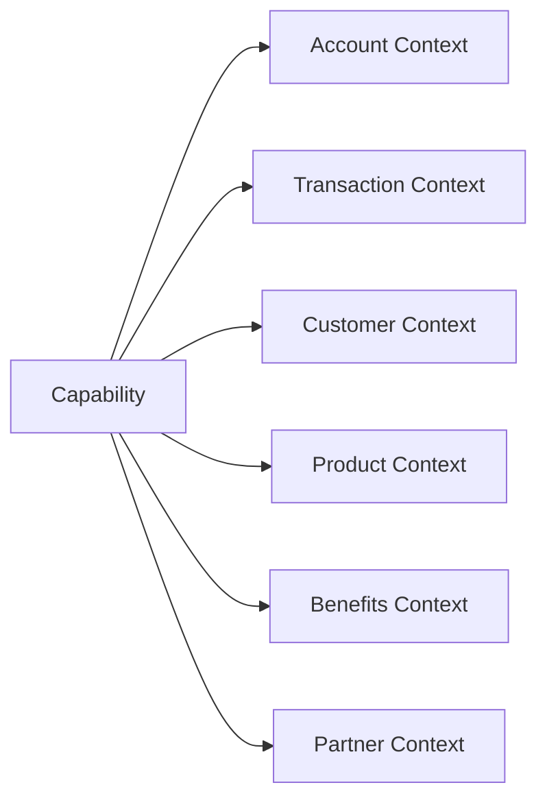

Uma capacidade pode ser suportada por mais de um elemento tecnológico.

Da mesma forma, um Bounded Context pode suportar várias capacidades relacionadas.

Por isso, a sequência recomendada é:

```text
Capability
     ↓
Business Functions
     ↓
Bounded Context
     ↓
Application Components
     ↓
Microservices
```

---

# 19. Capacidades e Core Bancário

A pergunta sobre aquisição de Core Bancário deve ser tratada no nível de capacidades.

A análise deverá responder:

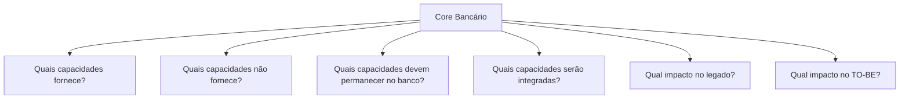

Para o cenário de Conta de Pagamentos, a análise deve principalmente investigar sua relação com:

- Gestão de Contas;
- Gestão de Transações;
- capacidades bancárias relacionadas.

Para Cashback, a análise deve investigar principalmente se o Core oferece capacidades relevantes para:

- transações;
- clientes;
- produtos;
- integração;
- demais capacidades que possam ser necessárias.

Não é possível concluir, a partir do case isoladamente, quais capacidades uma plataforma específica de Core Bancário forneceria.

---

# 20. Capability Map Consolidado

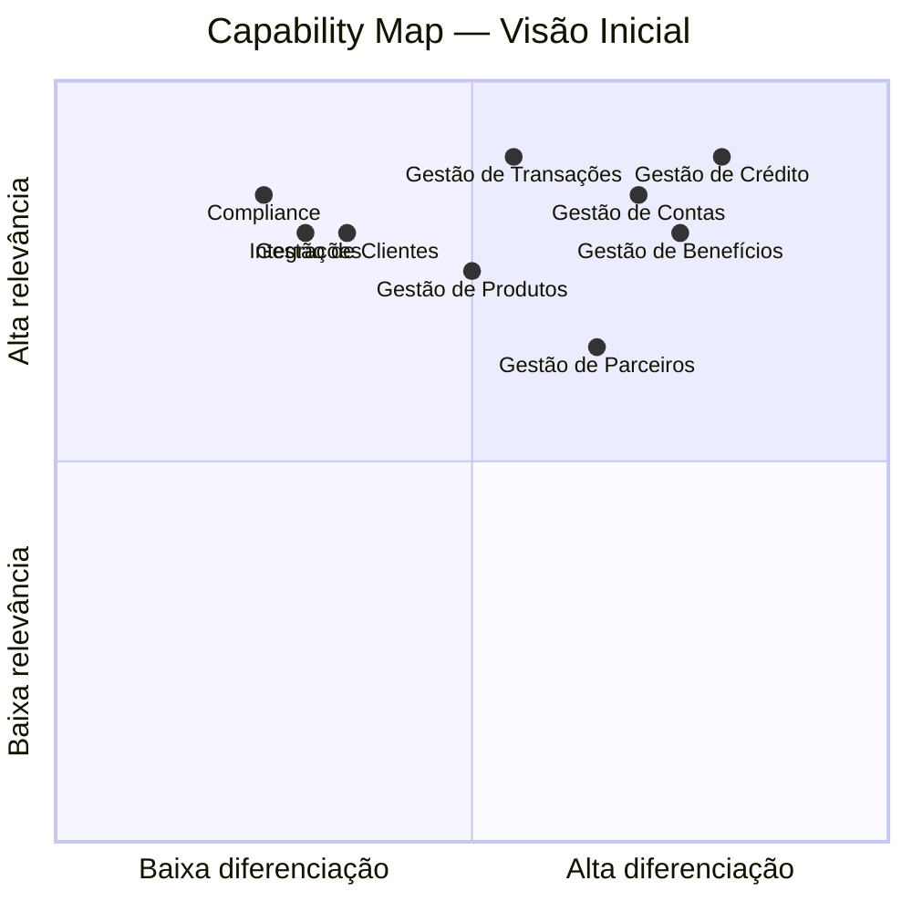

> Os valores do gráfico acima são **posicionamentos ilustrativos**, não avaliações quantitativas derivadas do case. Para uma classificação formal, será necessário definir critérios de diferenciação e relevância com o negócio.

---

# 21. Rastreabilidade Estratégica

## Conta de Pagamentos

```text
Driver:
Aumentar portfólio
        ↓
Goal:
Expandir oferta
        ↓
Objective:
Habilitar Conta de Pagamentos
        ↓
Capability:
Gestão de Contas
        ↓
Capability:
Gestão de Transações
        ↓
Value Stream:
Disponibilizar / Utilizar Conta
```

## Cashback

```text
Driver:
Aumentar portfólio e engajamento
        ↓
Goal:
Expandir relacionamento
        ↓
Objective:
Habilitar Cashback
        ↓
Capability:
Gestão de Benefícios
        ↓
Capability:
Gestão de Regras
        ↓
Capability:
Gestão de Parceiros
        ↓
Value Stream:
Transacionar → Avaliar → Calcular → Conceder
```

---

# 22. Próximos passos

O mapa de capacidades deve ser utilizado como entrada para:

```text
Capability Map
      ↓
Capability Assessment
      ↓
Heatmap de Capacidades
      ↓
Value Streams
      ↓
Business Functions
      ↓
Bounded Contexts
      ↓
Building Blocks
      ↓
Application Architecture
      ↓
Microservices
```

A próxima etapa recomendada é realizar o **Capability Assessment**, classificando cada capacidade por:

- importância estratégica;
- maturidade atual;
- nível de reutilização;
- grau de silificação;
- impacto do legado;
- potencial de diferenciação;
- necessidade de transformação.

Isso permitirá identificar onde a arquitetura atual possui os maiores gaps e quais capacidades devem ser priorizadas na arquitetura TO-BE.
